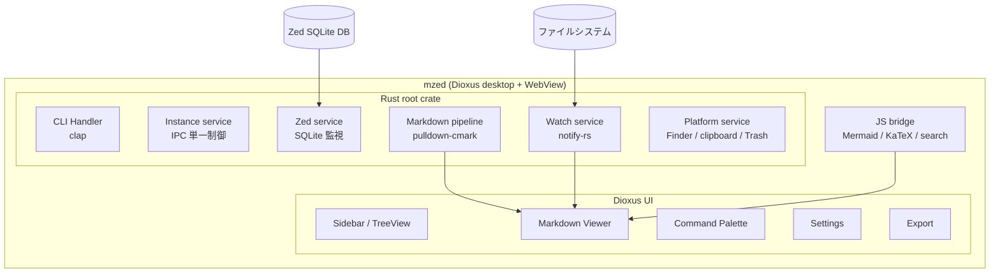
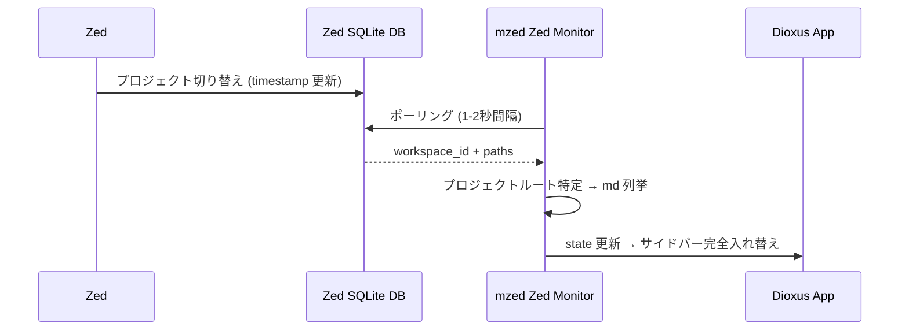
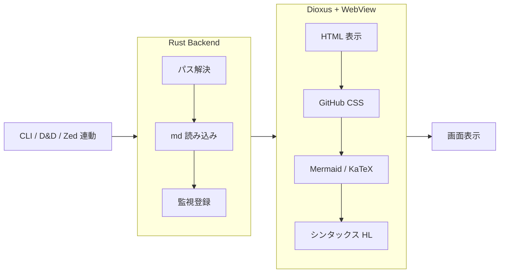

# 01 - アーキテクチャ

## 概要

mzed は Zed エディタ連動の Markdown ビューア。
Zed のプロジェクト切り替えを検知し、対応する docs を瞬時に表示する。

## システム構成

## Zed 連動

### 検知フロー

### 連動モード

| モード | 挙動 |
|---|---|
| `auto` | プロジェクト切り替え検知 → プロジェクト + md を自動切替 |
| `self` | プロジェクト切り替え検知 → コンテキストのみ切替、md は開かない |
| `off` | Zed 監視停止、手動操作のみ |

### 高速化

- 直近プロジェクトのファイルツリーをインメモリキャッシュ
- キャッシュヒット時はディスク I/O なしで即表示
- 初回アクセス時のみ FS スキャン

## シングルインスタンス制御

2回目以降の `mzed` 起動は、IPC ソケット経由で既存プロセスにファイルオープン要求を送る。新規プロセスは立ち上がらない。

## データフロー

