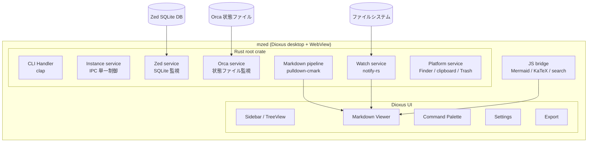
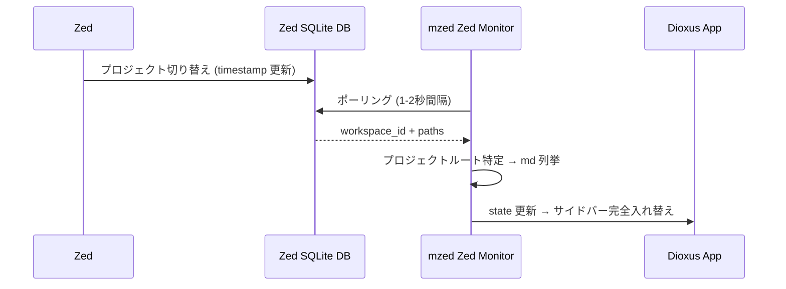
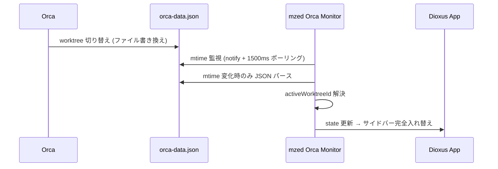
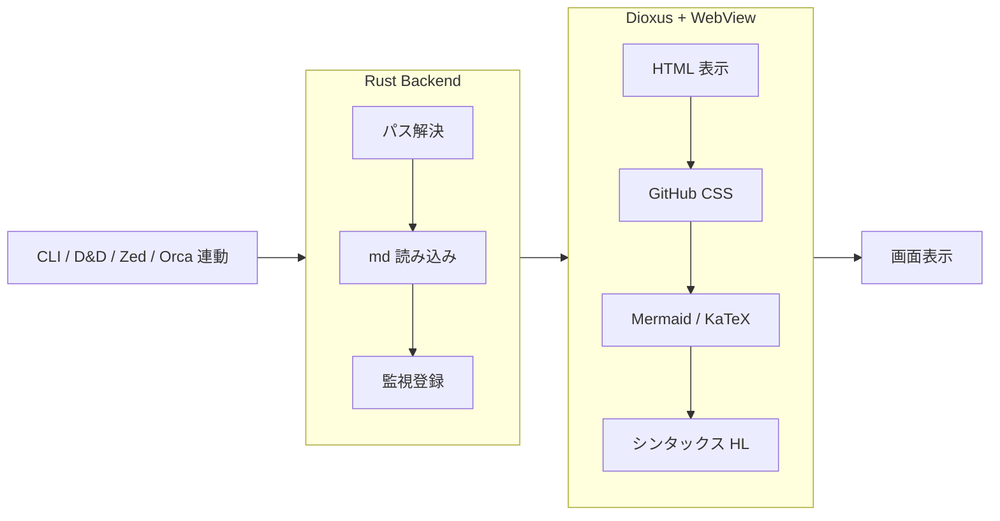

# 01 - アーキテクチャ

## 概要

mzed は Zed（エディタ）/ Orca（worktree 管理ツール）連動の Markdown ビューア。
どちらかのプロジェクト切り替えを検知し、対応する docs を瞬時に表示する。

## システム構成

```mermaid
graph TB
    subgraph "mzed (Dioxus desktop + WebView)"
        subgraph "Rust root crate"
            CLI[CLI Handler<br/>clap]
            IM[Instance service<br/>IPC 単一制御]
            ZM[Zed service<br/>SQLite 監視]
            OM[Orca service<br/>状態ファイル監視]
            FW[Watch service<br/>notify-rs]
            MD[Markdown pipeline<br/>pulldown-cmark]
            OS[Platform service<br/>Finder / clipboard / Trash]
        end
        subgraph "Dioxus UI"
            SB[Sidebar / TreeView]
            MR[Markdown Viewer]
            CP[Command Palette]
            ST[Settings]
            EX[Export]
        end
        UIJS[JS bridge<br/>Mermaid / KaTeX / search]
        MD --> MR
        FW --> MR
        UIJS --> MR
    end
    ZedDB[(Zed SQLite DB)] --> ZM
    OrcaFile[(Orca 状態ファイル)] --> OM
    FS[(ファイルシステム)] --> FW
```

## プロジェクト連動（Zed / Orca）

どちらに追従するかは `sync_source`（auto / zed / orca、既定 auto）で決める。詳細は [05](05-zed-integration.md) を参照。

### 検知フロー（Zed）

```mermaid
sequenceDiagram
    participant Zed
    participant DB as Zed SQLite DB
    participant Mon as mzed Zed Monitor
    participant App as Dioxus App

    Zed->>DB: プロジェクト切り替え (timestamp 更新)
    Mon->>DB: ポーリング (1-2秒間隔)
    DB-->>Mon: workspace_id + paths
    Mon->>Mon: プロジェクトルート特定 → md 列挙
    Mon->>App: state 更新 → サイドバー完全入れ替え
```

### 検知フロー（Orca）

```mermaid
sequenceDiagram
    participant Orca
    participant File as orca-data.json
    participant Mon as mzed Orca Monitor
    participant App as Dioxus App

    Orca->>File: worktree 切り替え (ファイル書き換え)
    Mon->>File: mtime 監視 (notify + 1500ms ポーリング)
    Mon->>File: mtime 変化時のみ JSON パース
    Mon->>Mon: activeWorktreeId 解決
    Mon->>App: state 更新 → サイドバー完全入れ替え
```

未文書化の内部形式のため全フィールドを optional として扱い、パース失敗・キー欠落・ファイル不在は「変化なし」に倒す。詳細は [05](05-zed-integration.md) の「Orca 連動」節を参照。

### 連動モード

`sync_mode`（下表）は Zed / Orca どちらの切替にも同じように適用される。

| モード | 挙動 |
|---|---|
| `auto` | プロジェクト切り替え検知 → プロジェクト + md を自動切替 |
| `self` | プロジェクト切り替え検知 → コンテキストのみ切替、md は開かない |
| `off` | 連動を停止、手動操作のみ |

### 高速化

- 直近プロジェクトのファイルツリーをインメモリキャッシュ
- キャッシュヒット時はディスク I/O なしで即表示
- 初回アクセス時のみ FS スキャン

## シングルインスタンス制御

2回目以降の `mzed` 起動は、IPC ソケット経由で既存プロセスにファイルオープン要求を送る。新規プロセスは立ち上がらない。

## データフロー

```mermaid
flowchart LR
    Input["CLI / D&D / Zed / Orca 連動"] --> Rust
    subgraph Rust["Rust Backend"]
        R1[パス解決] --> R2[md 読み込み] --> R3[監視登録]
    end
    Rust --> UI["Dioxus UI"]
    subgraph UI["Dioxus + WebView"]
        W1[HTML 表示] --> W2[GitHub CSS] --> W3[Mermaid / KaTeX] --> W4[シンタックス HL]
    end
    UI --> Display[画面表示]
```
