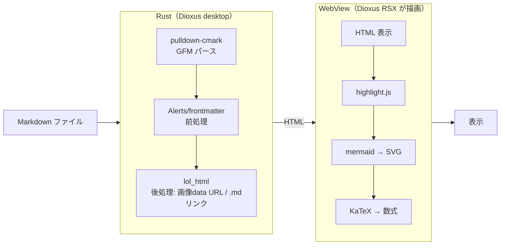

# 02 - 技術スタック

> 訂正（2026-06-28）: 初版は Tauri v2 + SolidJS + comrak + syntect を想定していたが、arto 公式リポジトリ（arto-app/Arto）調査の結果、**arto 準拠の Dioxus スタック**に確定した。本書は確定後の実スタックを記す。

## 確定（prototype 実装ベース）

| レイヤー | 技術 | 選定理由 |
|---|---|---|
| UI 基盤 | **Dioxus 0.7（desktop / webview）** | Rust だけで UI（RSX）を書ける。内部は tao + wry。arto と同系統。Tauri でも React/SolidJS でもない |
| バックエンド | Rust | パフォーマンス最優先 |
| MD パーサー | **pulldown-cmark 0.13** | GFM パース。Alerts / frontmatter は自前前処理で補う |
| シンタックス HL | **highlight.js（JS、WebView 注入）** | バンドル済み CDN assets。GitHub テーマ light/dark。prod では tree-sitter / syntect も検討 |
| HTML 後処理 | **lol_html 2** | 生成 HTML の書き換え（相対画像 → data URL、`.md` リンク → 内部リンク） |
| Mermaid / KaTeX | mermaid.js / KaTeX（JS） | SVG/数式は WebView 側でしか描画できない |
| CLI パーサー | clap 4 | Rust CLI のデファクト |
| ファイル監視 | notify-debouncer-full 0.4 | デバウンス付きファイル監視（ライブリロード・ツリー自動更新） |
| Zed DB アクセス | rusqlite（bundled, 読み取り専用） | Zed の SQLite を読む |
| シングルインスタンス | **interprocess 2（Unix ソケット + JSON Lines）** | 2 個目以降のプロセスは既存ウィンドウへルーティング。tauri-plugin は使わない |
| グローバルショートカット | **WebView の keydown ブリッジ（config 駆動キーマップ）** + muda メニュー（zoom 用） | Cmd+Shift+P 等。設定で再割当可 |
| スタイリング | github-markdown-css（light/dark） | GitHub 風の見た目 |
| ネイティブダイアログ | rfd 0.17 | フォルダ選択（エクスポート先・プロジェクト追加） |
| 外部リンク / Reveal | open 5 / `open -R`（Finder） | OS の既定アプリ／Finder で開く |
| テーマ検出 | dark-light 2 | システムのライト/ダーク検出 |
| エンコード | base64 / serde_json | 画像 data URL・設定 JSON |
| PDF エクスポート | （現状保留） | 簡易版 `window.print()` のみ。忠実版は WKWebView `createPDF`（objc2）が本命、chromiumoxide は重く非採用寄り |

## レンダリングの分担

パースと HTML 後処理は Rust、ハイライト・ダイアグラム・数式は JS。コールドスタートを速く保つため、重い描画は初回ペイント後に回す。

## 選定の補足

### なぜ Dioxus（Tauri/SolidJS でなく）

arto が実証済み（同じ用途・同じ macOS・同じ Mermaid/KaTeX 構成）。Rust だけで UI まで書け、言語を跨がない。WebView ベースなので Mermaid/KaTeX/GitHub CSS がそのまま動く。tao+wry 直叩きの面倒（IPC・メニュー・単一インスタンス）を Dioxus が吸収する。「Rust 縦串・最軽量」の志向に一致。

### なぜ pulldown-cmark（comrak でなく）

arto が pulldown-cmark を採用しており、速度面でも有利。GitHub Alerts・frontmatter は arto 同様、パース前後の自前処理で補う（`markdown/alerts.rs`, `markdown/frontmatter.rs`, `markdown/post_process.rs`）。

### シンタックスハイライト

現行実装は highlight.js（JS）。arto の desktop 直接依存にハイライト crate が無く、renderer 側 JS で処理する構成に倣う。prod で tree-sitter / syntect への置換を検討。

### PDF の現状

`window.print()` → OS の印刷ダイアログ →「PDF として保存」のみ実装。Mermaid/KaTeX は描画済みで出る。ダイアログ無しの 1 クリック PDF は描画エンジンが要る。本命は macOS ネイティブ `WKWebView.createPDF`（objc2 FFI、依存追加なし）。chromiumoxide は Chromium 同梱で重く、軽量志向と矛盾するため非採用寄り。判断は保留。

## 方針

- Rust 側 crate は最小限。パフォーマンスに直結するもののみ
- JS 側も最小限。バンドルサイズを意識（mermaid.min.js が最大）
- 起動時間の目標: 体感即時
