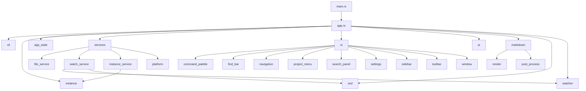

# 04 - プロジェクト構成

## ディレクトリ

```
mzed/
├── docs/
│   ├── research/                # 調査資料
│   └── specs/                   # 設計仕様書
│
├── src/                         # Dioxus root crate
│   ├── main.rs                  # 起動のみ
│   ├── app.rs                   # Dioxus app shell / wiring
│   ├── cli.rs
│   ├── config.rs
│   ├── instance.rs
│   ├── zed.rs
│   ├── watcher.rs
│   ├── app_state/
│   ├── js/
│   ├── markdown/
│   ├── services/
│   └── ui/
│       ├── command_palette.rs
│       ├── find_bar.rs
│       ├── navigation.rs
│       ├── project_menu.rs
│       ├── search_panel.rs
│       ├── settings.rs
│       ├── sidebar.rs
│       ├── toolbar.rs
│       └── window.rs
│
├── assets/                      # WebView assets (CSS / Mermaid / KaTeX)
├── tests/                       # 統合テスト（cargo nextest）
│   ├── fixtures/                # Markdown テストフィクスチャ
│   └── instance_integration.rs  # 二重起動・stale socket・ソケット権限等
│
├── Dioxus.toml
├── Justfile
├── README.md
└── .gitignore
```

## Rust モジュール依存



## 設定ファイル

パス: `~/.config/mzed/`

```jsonc
// config.json — ユーザー設定
{
  "theme": "system",             // light | dark | system
  "sync_mode": "auto",           // auto | self | off
  "zoom": 1.0,
  "favorites": [],
  "window_width": 1100,
  "window_height": 760,
  "startup": "restore",
  "keybindings": []
}
```

```jsonc
// session.json — 自動管理
{
  "roots": ["/path/to/project"],
  "tabs": ["/path/to/project/README.md"],
  "active": "/path/to/project/README.md",
  "sidebar_width": 280,
  "project_tabs": {
    // プロジェクト別の最終タブ状態（キー: プロジェクトルートパス）
    "/path/to/project": {
      "tabs": ["/path/to/project/README.md"],
      "active": "/path/to/project/README.md"
    },
    "/path/to/other-project": {
      "tabs": ["/path/to/other-project/docs/index.md"],
      "active": "/path/to/other-project/docs/index.md"
    }
  }
}
```
