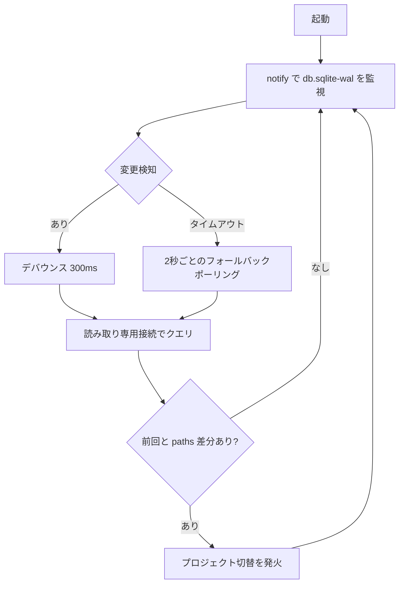

# 05 - Zed 連動

mzed の中核。Zed のプロジェクト切り替えを検知し、対応する docs を切り替える。

## Zed の状態保存先

```
~/Library/Application Support/Zed/db/0-stable/db.sqlite
```

ジャーナルモードは WAL。`db.sqlite-wal` / `db.sqlite-shm` が併存する。

### workspaces テーブル（抜粋・実スキーマ）

```sql
CREATE TABLE workspaces (
  workspace_id  INTEGER PRIMARY KEY,
  paths         TEXT,           -- プロジェクトのルートパス
  paths_order   TEXT,           -- マルチルート時の順序
  timestamp     TEXT DEFAULT CURRENT_TIMESTAMP NOT NULL,  -- 最終アクティブ時刻
  window_id     INTEGER,        -- ウィンドウ識別子
  session_id    TEXT,           -- 起動セッション識別子
  window_state  TEXT,
  ...
);
```

実データの確認結果:

- `paths` は単一ルートならパス1つ。マルチルートワークスペースでは複数パスを保持
- `timestamp` は秒精度のローカル時刻テキスト（例 `2026-06-21 10:22:08`）
- プロジェクトを切り替えると、対応する行の `timestamp` が更新される
- 同一ウィンドウ内で複数プロジェクトを開くと、同じ `window_id` の複数行が更新される
- 複数ウィンドウを開くと `window_id` が複数存在する

## アクティブプロジェクトの判定

> 重要: 当初は「`timestamp` 最大の行 = アクティブ」とする予定だったが、prototype 検証で**これは誤り**と判明した。`workspaces.timestamp` はフォーカスだけでなく LSP・オートセーブ・ファイル開閉・裏ウィンドウの活動でも更新され、別プロジェクトに勝手に切り替わる。正しい信号は別テーブルにある。

正しい判定はフォーカス中ウィンドウ → そのウィンドウのアクティブワークスペース → paths の3段。

1. `kv_store('session_window_stack')` = ウィンドウのフォーカス順（JSON 配列、**先頭がフォーカス中**）
2. `scoped_kv_store(namespace='multi_workspace_state', key=<window_id>)` の値 JSON にある `active_workspace_id` = そのウィンドウで今アクティブなワークスペース
3. `workspaces.workspace_id = active_workspace_id` の `paths`

```sql
-- 1. フォーカス中ウィンドウ
SELECT json_extract(value, '$[0]') FROM kv_store WHERE key = 'session_window_stack';
-- 2. そのウィンドウのアクティブワークスペース
SELECT json_extract(value, '$.active_workspace_id')
FROM scoped_kv_store
WHERE namespace = 'multi_workspace_state' AND key = :window_id;
-- 3. paths 解決
SELECT paths, timestamp FROM workspaces WHERE workspace_id = :active_workspace_id;
```

JSON は bundled SQLite の `json_extract` で SQL 側で抽出できる。これでフォーカス変更時だけ追従し、裏の活動には反応しない。

フォールバック: 上記キーが無い古い Zed では `timestamp` 最大の行に退避する。

mzed は「Zed で今フォーカスしているプロジェクト」を追従する。これがユーザーの期待に一致する。

## 検知方式

ファイル監視とポーリングのハイブリッド。



理由:

- WAL は書き込みのたびに更新されるので `db.sqlite-wal` を監視対象にする
- 変更は連続発火しやすいのでデバウンスでまとめる
- notify が取りこぼす環境向けに、2秒間隔のポーリングを保険として併用

## DB 読み取りの安全性

Zed の DB を壊さないため、必ず読み取り専用で開く。

```rust
// rusqlite: 読み取り専用 + WAL の未チェックポイント分も読む
let conn = Connection::open_with_flags(
    db_path,
    OpenFlags::SQLITE_OPEN_READ_ONLY | OpenFlags::SQLITE_OPEN_NO_MUTEX,
)?;
conn.pragma_update(None, "query_only", true)?;
```

- 書き込みは一切しない
- Zed が書き込み中でも WAL モードなら読み取りはブロックされにくい
- ロック競合時はリトライ（指数バックオフ、最大3回）

## マルチルート対応

`paths` に複数ルートが入る場合、全ルートの docs を集約してサイドバーに出す。`paths_order` で表示順を決める。

v1 は単一ルートを主対象とし、マルチルートは「全ルートをフラットに集約」で対応する。ルートごとのグルーピング表示は将来検討（FT）。

## 連動モード別の挙動

| モード | Zed 切替検知時の動作 |
|---|---|
| `auto` | プロジェクトを切り替え、docs 配下の md を自動で開く |
| `self` | プロジェクトコンテキストだけ切り替える。md は自動で開かない（サイドバーは更新、ビューアは現状維持） |
| `off` | Zed 監視を止める。手動操作のみ |

モード切替はコマンドパレット（P-02）、`--sync` フラグ（L-04）、または固定トグル（P-07: Cmd+Shift+L、auto⇄self を即切替）から。

## マルチウィンドウ時の追従制限

Cmd+N で開いた **2枚目以降のウィンドウ**はベースウィンドウに対してサブウィンドウとして扱われる。

| ウィンドウ | sync_mode 初期値 | Zed 監視ループ |
|---|---|---|
| ベースウィンドウ（最初に開いたウィンドウ） | config 設定に従う | 有効 |
| 2枚目以降（Cmd+N） | SelfPinned（固定） | 無効 |

サブウィンドウは起動時に SelfPinned が強制されるため、ベースウィンドウのプロジェクト切替の影響を受けない。

## md の自動展開ロジック（auto モード）

プロジェクト切替後、開く md の優先順位:

1. `docs/` 配下の md（あれば）
2. リポジトリルートの `README.md`
3. ルート直下の md ファイル

サイドバーにはプロジェクト全体の md を出す（docs 限定にしない。ユーザー要望）。

## エッジケース

| ケース | 挙動 |
|---|---|
| Zed 未起動 / DB 不在 | 監視は待機。手動操作は可能 |
| DB ロック中 | リトライ。失敗したら次の検知まで待つ |
| 同一秒に複数行更新 | `window_id` の一致を優先し、なければ `workspace_id` の大きい方を採用 |
| 複数 Zed ウィンドウ | session_window_stack 先頭ウィンドウに追従。フォールバックは timestamp 最新行 |
| 同一プロジェクト再フォーカス | root/tabs はそのまま維持し再ロードをスキップ（リアクティブ更新なし）|
| paths が存在しないパス | スキップして次点を採用 |
| 切替先に md が無い | サイドバーは空表示、ビューアはプレースホルダ |

## 状態保持

```rust
struct ZedSyncState {
    mode: SyncMode,              // Auto | SelfOnly | Off
    last_active_paths: Vec<PathBuf>,
    last_timestamp: String,
    last_window_id: Option<i64>,
}
```

`last_*` と DB の最新を比較し、差分があるときだけ切替を発火する。無駄な再描画を避ける。
