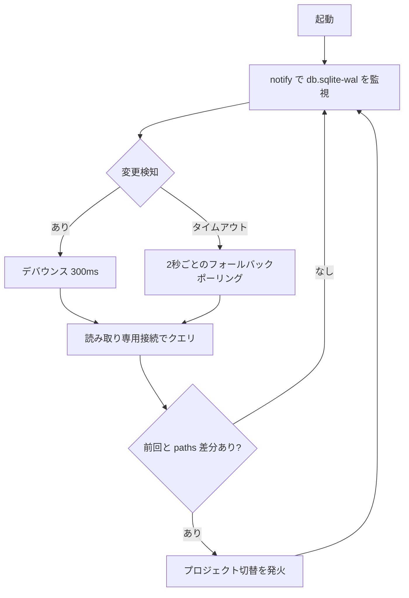

# 05 - プロジェクト連動（Zed / Orca）

mzed の中核。**Zed** と **Orca** のプロジェクト切り替えを検知し、対応する docs を切り替える。
どちらに追従するかは `sync_source`（→ 末尾「Orca 連動」）で決める。既定は `auto`（両方を見て、最後に切り替えた方に追従）。

## Zed の状態保存先

```
~/Library/Application Support/Zed/db/0-stable/db.sqlite
```

ジャーナルモードは WAL。`db.sqlite-wal` / `db.sqlite-shm` が併存する。

### workspaces テーブル（抜粋・実スキーマ）

```sql
CREATE TABLE workspaces (
  workspace_id  INTEGER PRIMARY KEY,
  paths         TEXT,           -- プロジェクトのルートパス
  paths_order   TEXT,           -- マルチルート時の順序
  timestamp     TEXT DEFAULT CURRENT_TIMESTAMP NOT NULL,  -- 最終アクティブ時刻
  window_id     INTEGER,        -- ウィンドウ識別子
  session_id    TEXT,           -- 起動セッション識別子
  window_state  TEXT,
  ...
);
```

実データの確認結果:

- `paths` は単一ルートならパス1つ。マルチルートワークスペースでは複数パスを保持
- `timestamp` は秒精度のローカル時刻テキスト（例 `2026-06-21 10:22:08`）
- プロジェクトを切り替えると、対応する行の `timestamp` が更新される
- 同一ウィンドウ内で複数プロジェクトを開くと、同じ `window_id` の複数行が更新される
- 複数ウィンドウを開くと `window_id` が複数存在する

## アクティブプロジェクトの判定

> 重要: 当初は「`timestamp` 最大の行 = アクティブ」とする予定だったが、prototype 検証で**これは誤り**と判明した。`workspaces.timestamp` はフォーカスだけでなく LSP・オートセーブ・ファイル開閉・裏ウィンドウの活動でも更新され、別プロジェクトに勝手に切り替わる。正しい信号は別テーブルにある。

正しい判定はフォーカス中ウィンドウ → そのウィンドウのアクティブワークスペース → paths の3段。

1. `kv_store('session_window_stack')` = ウィンドウのフォーカス順（JSON 配列、**先頭がフォーカス中**）
2. `scoped_kv_store(namespace='multi_workspace_state', key=<window_id>)` の値 JSON にある `active_workspace_id` = そのウィンドウで今アクティブなワークスペース
3. `workspaces.workspace_id = active_workspace_id` の `paths`

```sql
-- 1. フォーカス中ウィンドウ
SELECT json_extract(value, '$[0]') FROM kv_store WHERE key = 'session_window_stack';
-- 2. そのウィンドウのアクティブワークスペース
SELECT json_extract(value, '$.active_workspace_id')
FROM scoped_kv_store
WHERE namespace = 'multi_workspace_state' AND key = :window_id;
-- 3. paths 解決
SELECT paths, timestamp FROM workspaces WHERE workspace_id = :active_workspace_id;
```

JSON は bundled SQLite の `json_extract` で SQL 側で抽出できる。これでフォーカス変更時だけ追従し、裏の活動には反応しない。

フォールバック: 上記キーが無い古い Zed では `timestamp` 最大の行に退避する。

mzed は「Zed で今フォーカスしているプロジェクト」を追従する。これがユーザーの期待に一致する。

## 検知方式

ファイル監視とポーリングのハイブリッド。


```mermaid
flowchart TD
    Start[起動] --> Watch[notify で db.sqlite-wal を監視]
    Watch --> Change{変更検知}
    Change -->|あり| Debounce[デバウンス 300ms]
    Debounce --> Query[読み取り専用接続でクエリ]
    Query --> Compare{前回と paths 差分あり?}
    Compare -->|あり| Switch[プロジェクト切替を発火]
    Compare -->|なし| Watch
    Change -->|タイムアウト| Poll[2秒ごとのフォールバックポーリング]
    Poll --> Query
    Switch --> Watch
```

理由:

- WAL は書き込みのたびに更新されるので `db.sqlite-wal` を監視対象にする
- 変更は連続発火しやすいのでデバウンスでまとめる
- notify が取りこぼす環境向けに、2秒間隔のポーリングを保険として併用

## DB 読み取りの安全性

Zed の DB を壊さないため、必ず読み取り専用で開く。

```rust
// rusqlite: 読み取り専用 + WAL の未チェックポイント分も読む
let conn = Connection::open_with_flags(
    db_path,
    OpenFlags::SQLITE_OPEN_READ_ONLY | OpenFlags::SQLITE_OPEN_NO_MUTEX,
)?;
conn.pragma_update(None, "query_only", true)?;
```

- 書き込みは一切しない
- Zed が書き込み中でも WAL モードなら読み取りはブロックされにくい
- ロック競合時はリトライ（指数バックオフ、最大3回）

## マルチルート対応

`paths` に複数ルートが入る場合、全ルートの docs を集約してサイドバーに出す。`paths_order` で表示順を決める。

「同じプロジェクトへの再選択」の判定は **roots 全体の一致**で行う（primary root だけでは足りない）。Zed のマルチルートワークスペースからフォルダが 1 つ外れた場合や、同じリポジトリを Zed が `[A, B]`、Orca が `[A]` として報告する場合、primary は同じでもサイドバーは変わる必要がある。primary が同じで roots だけが違うときは **roots とツリーだけ更新し、タブとユーザーのツリー展開状態は維持する**（プロジェクト切替ではないため）。

v1 は単一ルートを主対象とし、マルチルートは「全ルートをフラットに集約」で対応する。ルートごとのグルーピング表示は将来検討（FT）。

## 連動モード別の挙動

| モード | Zed 切替検知時の動作 |
|---|---|
| `auto` | プロジェクトを切り替え、docs 配下の md を自動で開く |
| `self` | プロジェクトコンテキストだけ切り替える。md は自動で開かない（サイドバーは更新、**開いているタブと分割はそのまま**） |
| `off` | Zed 監視を止める。手動操作のみ |

モード切替はコマンドパレット（P-02）、`--sync` フラグ（L-04）、または固定トグル（P-07: Cmd+Shift+L、auto⇄self を即切替）から。Cmd+Shift+L のトーストは追従元を反映する（`Sync: Auto (following Zed & Orca)` / `(following Orca)`）。

### worktree を開いたときの挙動（`worktree_switch`、既定 `main`）

プロジェクトルートの `.git` が**ファイル**なら linked worktree（または submodule checkout）である。通常の checkout は `.git` がディレクトリ。その worktree を開こうとしたときの挙動を 3 択で選ぶ（設定 > プロジェクト連動）。

| 値 | 挙動 | 適用される経路 |
|---|---|---|
| `main`（既定） | `.git` ファイルから親 checkout を引き、**親リポジトリを開く**。worktree 側の docs はオーバーレイで親のツリーに合成される（→ 次節） | プロジェクトの新規オープン経路すべて（Zed / Orca / CLI / D&D / Cmd+O / お気に入り）。セッション復元・単一ファイルの直接オープン・Task View は対象外 |
| `skip` | 切替を無視して現在の表示を維持する | Zed 由来のみ |
| `follow` | worktree をそのまま開く（`worktree_switch` 導入前の `sync_skip_worktrees: false` 相当） | — |

`main` を既定にしたのは、docs を main 側で持つ運用でも worktree 側で書いた docs を見たいという要求に、オーバーレイ（次節）が既に応えているため。親に集約すれば全 worktree + 親の docs が 1 つのツリーに見える。`skip`（旧既定）は「worktree に追従しても見せるものがない」前提の挙動で、オーバーレイが無かった時代の名残。

実装は 2 箇所に分かれる。

- `skip` の判定は追従ループのバースト畳み込みの**前**（`sync::skipped`）。理由は末尾「Orca 連動」に同じ。
- `main` の付け替えは `worktrees::redirect(primary, roots, mode)` が担う。`switch_project` に渡す前の唯一の入口（`app.rs` の `open_project`）で呼ぶので、どの経路から来た切替も同じ扱いになる。roots 全体を親へ写して順序を保ち、同じ親になった root は 1 つに畳む（`[main, main の worktree]` は `[main]`）。primary は写した結果の先頭（各 root の `.git` を読むのは 1 回だけ）。
- 付け替えた結果が**今表示している選択と同じなら何もしない**（`same_selection`）。同じリポジトリの worktree A → B の移動は、親から見れば同じプロジェクトなので、代表 Markdown を開き直してタブを奪ってはいけない。`pick_markdown` の走査もこの判定より後に置く。
- 親が引けない root はそのまま残す。`main_root_of` は git の実レイアウト `<main>/.git/worktrees/<name>` が**ディスク上に揃っていること**を要求する（指示先が実在し、その親が `worktrees`、その親が `.git` ディレクトリ）。祖先をそのまま親と見なすと、消えた worktree の `gitdir: /tmp/gone/x` が `/tmp` を「親リポジトリ」にしてしまう。submodule checkout（`<super>/.git/modules/<name>`）も対象外 — superproject のオーバーレイは submodule の docs を見られないので、付け替えると逆に見えなくなる。
- 開くファイル（`pick_markdown`）は**付け替え後**の親側で選ぶ。worktree で更新されたファイルはオーバーレイで親に見える。
- 性能: `main_root_of` は `.git` ファイルの読み取り 1 回 + 数回の `stat`。イベント 1 件につき root ごと 1 回で、オーバーレイの走査コストは増えない（親を表示するのは従来と同じ経路）。

`skip` が Zed 由来だけなのは、Orca が worktree 管理アプリで、その切替は定義上 worktree 切替だから（スキップすると Orca 連動そのものが無効になる）。CLI / D&D / Cmd+O の明示操作も `skip` では制限しない（ユーザーが指名したものは開く）。

### worktree オーバーレイ（常時 ON）

`worktree_switch: main` の相方。mzed が main の checkout を表示している間、そのリポジトリの **linked worktree 側で更新された docs を UI 上 main に重ねて見せる**。worktree で作業しつつ mzed は main を開いたままでよい。ファイルのコピー・書き込みは一切しない。

- **検出**: `.git/worktrees/<name>/gitdir` を直接読む（git コマンド起動なし）。消えた worktree の残骸登録は無視。worktree の追加/削除はツリー監視経由で自動反映
- **本文**: 表示パスは常に main 側の「論理パス」。読み込み時に main + 各 worktree の同相対パスを **mtime 比較し最新の実体**を表示（出所表示なし）。全候補をウォッチし、どの checkout の保存でも即再解決
- **サイドバー**: worktree にしかない md / フォルダも main のツリーに合成表示（ノードは論理パス）。同名は1ノードに集約
- **Task View**: worktree 配下のタスクは main プロジェクトに帰属。同名タスクフォルダは task.md の mtime が新しい checkout 側が残る。走査で worktree が独立プロジェクトとして発見された場合も main に合流
- **全文検索**: 表示される側（最新の実体）を検索し、ヒットは論理パスで表示
- **リンク/画像**: worktree 実体から読んだ文書の相対参照はその checkout 内で解決（worktree root をレンダリング許可 roots に追加）。内部リンクのクリックは論理パスに正規化して開く
- タブ・セッション・ハイライトは常に論理パスなので、worktree を消せば自動的に main の内容へ戻る

## マルチウィンドウ時の追従制限

Cmd+N で開いた **2枚目以降のウィンドウ**はベースウィンドウに対してサブウィンドウとして扱われる。

| ウィンドウ | sync_mode 初期値 | Zed 監視ループ |
|---|---|---|
| ベースウィンドウ（最初に開いたウィンドウ） | config 設定に従う | 有効 |
| 2枚目以降（Cmd+N） | SelfPinned（固定） | 無効 |

サブウィンドウは起動時に SelfPinned が強制されるため、ベースウィンドウのプロジェクト切替の影響を受けない。

最後のタブを閉じてベースウィンドウが画面から消えた後も、購読ループは生きたままで追従を続ける。プロジェクトが実際に切替わった時点でウィンドウが画面に戻る（→ [07](07-ipc-and-concurrency.md#ウィンドウの退場最後のタブを閉じたとき)）。いま表示しているのと同じ選択が再報告されただけのときは戻らない。

## md の自動展開ロジック（auto モード）

プロジェクト切替後、開く md の優先順位:

1. `docs/` 配下の md（あれば）
2. リポジトリルートの `README.md`
3. ルート直下の md ファイル

サイドバーにはプロジェクト全体の md を出す（docs 限定にしない。ユーザー要望）。

## エッジケース

| ケース | 挙動 |
|---|---|
| Zed 未起動 / DB 不在 | 監視は待機。手動操作は可能 |
| DB ロック中 | リトライ。失敗したら次の検知まで待つ |
| 同一秒に複数行更新 | `window_id` の一致を優先し、なければ `workspace_id` の大きい方を採用 |
| 複数 Zed ウィンドウ | session_window_stack 先頭ウィンドウに追従。フォールバックは timestamp 最新行 |
| 同一プロジェクト再フォーカス | root/tabs はそのまま維持し再ロードをスキップ（リアクティブ更新なし）|
| paths が存在しないパス | スキップして次点を採用 |
| 切替先に md が無い | サイドバーは空表示、ビューアはプレースホルダ |

## Orca 連動

Orca（worktree / ターミナル管理アプリ）のアクティブ worktree にも同じ仕組みで追従する。

### 状態保存先

```
~/Library/Application Support/orca/profiles/<profile>/orca-data.json
```

> **未文書化依存**。Orca の公開 API ではなく内部ファイルであり、2026-09-09 に実機で確認した形を読んでいる。Orca 側の変更で壊れうるので、全フィールドを optional として扱い、パース失敗・キー欠落・ファイル不在はすべて「変化なし」に倒す（エラーをユーザーに出さない）。

プロファイルは通常 `local-default` の 1 つ。複数ある場合は `orca-data.json` の mtime が最新のものを使う。
環境変数 `MZED_ORCA_DATA` でパスを差し替えられる（**手動検証用**。Orca の実ファイルは読み取り専用で、コピーに対して検証する）。

### 読むキー

| キー | 意味 |
|---|---|
| `workspaceSession.activeWorktreeId` | 今アクティブな worktree の id |
| `workspaceSession.lastVisitedAtByWorktreeId` | `"local\|<worktreeId>" -> ms epoch`。`activeWorktreeId` が無い / 解決できないときのフォールバック |
| `folderWorkspaces[]` | `id` と `folderPath`。`folder:` 形式の id をパスへ解決するために引く |

worktree id は 2 形式ある。

| 形式 | 解決方法 |
|---|---|
| `<repoUuid>::<絶対パス>` | `::` 以降がプロジェクトのパス |
| `folder:<uuid>` | `folderWorkspaces[]` の `id == <uuid>` の要素の `folderPath` |

### 検知方式

Zed と同じ notify + 1500ms ポーリングのハイブリッド。ただし `orca-data.json` は約 500KB の単一 JSON を Orca が頻繁に書き換えるため、**mtime が動いたときだけ**パースする（ポーリングのたびに 500KB を読み直さない）。
Orca はファイルを置き換えて書くので、監視対象はファイルではなく**親ディレクトリ**。
書き込み途中の不完全な JSON を読んでしまった場合はパース失敗として前回値を維持し、mtime 記録をクリアして次回必ず読み直す（リネームで戻された古い mtime も取りこぼさない）。
変化判定は Zed と同じく**解決後のパスのみ**で行う（Orca は UI 操作のたびにファイルを触るため）。

### 追従元（`sync_source`、既定 `auto`）

| 値 | 挙動 |
|---|---|
| `auto` | Zed と Orca の両方を購読し、イベントが来た順に追従する |
| `zed` | Zed のイベントだけ採用（Orca は無視） |
| `orca` | Orca のイベントだけ採用（Zed は無視） |

複数のイベントが処理前に溜まっていた場合（起動直後は両ウォッチャが現在値を報告する）は、1 回の切替に畳み込む。規則は 2 つだけ。

1. アクティブプロジェクトが無いイベント（`None`）は切替先を持たないので**候補から外す**。
2. 残った中から**到着順で最後のもの**を採る。

**ソースによる優先は設けない**。片方を常に優先すると `Zed(A) → Orca(B) → Zed(C)` で C が捨てられ、`Zed(Some) → Orca(None)` では正常な Zed の切替まで失われる。「最後に操作した方に追従する」という `auto` の定義そのものが規則になる。判定は `src/sync.rs` の `accepts` / `admit` / `admit_burst`（pure、ユニットテスト済み）。

例外は各ウォッチャの**初回報告**（起動時に見つけた現在値。ユーザーの操作ではない）だけで、これは到着順に依らず Zed が勝つ。Orca 以前の mzed は Zed だけを追っていたので、起動時に別の場所へ着地するのは退行に見えるため。

初回報告はイベントに `initial: true` として乗る（`watch_service` が各スレッドの最初のコールバックにだけ付ける）。app 側は「今どこに着地しているか」を `Landing`（`Nothing` / `Startup(origin)` / `Switch`）で持ち、`sync.rs` の `admit` が 1 件ずつ判定する。

| 着地状態 | `initial: false`（実際の切替） | Zed の初回報告 | Orca の初回報告 |
|---|---|---|---|
| `Nothing` | 適用 | 適用 | 適用 |
| `Startup(Orca)` | 適用 | 適用（Zed が勝つ） | — |
| `Startup(Zed)` | 適用 | — | 無視 |
| `Switch` | 適用 | 無視 | 無視 |

これで 2 つの初回報告が同じバーストに揃うかどうかに関係なく着地が決まる（実測では別々の wake-up に分かれる）。遅れて届いた初回報告が、その間にユーザーがした切替を巻き戻すこともない。

`sync_mode`（auto / self / off）は上位ポリシーとして両ソースに等しくかかる。`off` なら Orca の切替も無視し、`self` なら root だけ更新する。

`worktree_switch: skip` は **Zed 由来のイベントにだけ**適用する。Orca は worktree 管理アプリで、その切替は定義上 worktree 切替なので、スキップすると Orca 連動そのものが機能しなくなる。`main` は Orca 由来にも適用する（Orca で worktree に移ると mzed は親リポジトリを表示する）。

スキップ判定は畳み込みの**前**に行い、対象の Zed イベントはバーストから取り除く。畳み込みの後に判定すると、捨てるはずの Zed イベントが着地を確定させ、同じバーストに居た有効な Orca イベントまで消えてしまう（起動時も、スキップされた Zed の初回報告が Orca の初回報告を拒否してしまう）。`sync_source` による絞り込みも同じ理由で畳み込みの前に置く。`main` の付け替えは逆に畳み込みの**後**（切替が 1 つに決まってから）で、イベントの取捨には関与しない。

### エッジケース

| ケース | 挙動 |
|---|---|
| Orca 未インストール / プロファイル無し | 1500ms ごとに状態ファイルの出現を待ち続ける（`stat` のみ）。Orca を後から入れても mzed の再起動は要らない |
| パースできるが `activeWorktreeId` 等が無い | 前回値を維持（Orca 側の形式変更を「プロジェクト無し」と誤認しない） |
| `orca-data.json` が消えた / リネームされた | 前回値を維持。戻せば追従を再開する |
| 書き込み途中の不完全 JSON | 前回値を維持。次のポーリングで読み直す |
| `activeWorktreeId` が解決できない id | `lastVisitedAtByWorktreeId` の最新へフォールバック |

`workspaceSession.activeFileIdByWorktree`（worktree ごとの開いているファイル）は存在するが、本仕様では読まない。

### ログ

異常は無音にせず `~/Library/Logs/mzed/mzed.log` に出す。1500ms ごとに同じ行を吐かないよう、**状態が変わったときだけ**記録する（初回の異常、異常種別の変化、復帰）。

```
orca: no state file found; waiting for one to appear
orca: cannot watch <dir>: <err>
orca: cannot read <path>; keeping current project
orca: <path> is not valid JSON (mid-write?); keeping current project
orca: no active worktree in <path>; keeping current project
orca: reading <path>
```

## 状態保持

```rust
struct ZedSyncState {
    mode: SyncMode,              // Auto | SelfOnly | Off
    last_active_paths: Vec<PathBuf>,
    last_timestamp: String,
    last_window_id: Option<i64>,
}
```

`last_*` と DB の最新を比較し、差分があるときだけ切替を発火する。無駄な再描画を避ける。
