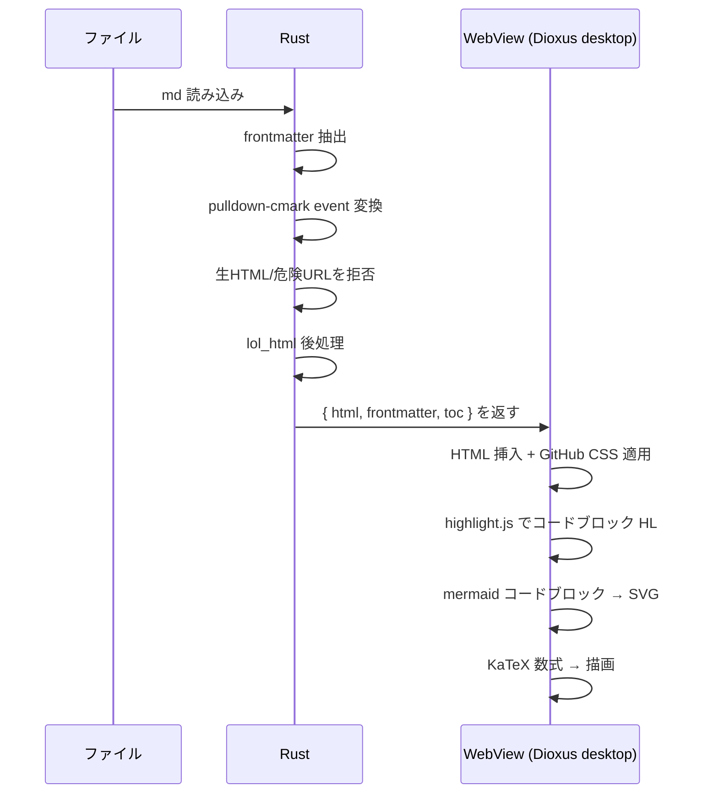
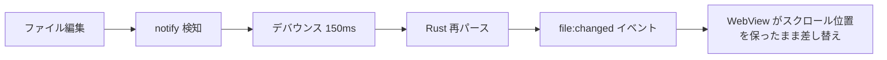

# 06 - レンダリングパイプライン

Markdown を GitHub 忠実に表示するまでの流れ。Rust でパース、WebView で仕上げ。

## 全体フロー



## Rust 側の処理

### pulldown-cmark 設定

GitHub 互換のため以下の拡張を有効化する。

| 拡張 | 用途 |
|---|---|
| table | GFM テーブル |
| strikethrough | 取り消し線 |
| tasklist | チェックボックス |
| footnotes | 脚注 |
| alerts | GitHub Alerts (`> [!NOTE]` 等、現行は前処理) |
| frontmatter | YAML frontmatter 抽出 |

### highlight.js

コードブロックは `language-*` class を持つ HTML として出力し、WebView 側の highlight.js でハイライトする。Mermaid のコードブロックは `<pre class="mermaid">` として出力し、本文は text event として escape する。

### サニタイズ

生 HTML は許可しない。ユーザー由来の `Event::Html` / `Event::InlineHtml` は text として表示する。

Markdown URL は scheme を allowlist する。

- link: `http`, `https`, `mailto`, fragment, relative path
- image: `http`, `https`, relative path
- reject: `javascript`, `data`, `file`, protocol-relative URL

相対画像と `.md` link は `lol_html` 後処理で canonicalize し、project root 配下に収まる場合だけ解決する。拒否時は `src` / `href` を削除する。SVG は P0 では埋め込まない。

Mermaid は `securityLevel: 'strict'` を既定にする。

### 出力構造

```rust
struct RenderResult {
    html: String,            // サニタイズ済み HTML
    frontmatter: Option<serde_yaml::Value>,
    toc: Vec<TocEntry>,      // 見出しツリー
    title: Option<String>,   // frontmatter.title or 先頭 h1
}

struct TocEntry {
    level: u8,
    text: String,
    anchor: String,
    children: Vec<TocEntry>,
}
```

ToC は pulldown-cmark event から見出しを拾って構築する。WebView 側で再パースしない。

## WebView 側の処理

### Mermaid

`<pre class="mermaid">` を走査し、mermaid.js で SVG に変換して差し替える。描画後、SVG を画像コピーできるようにツールバーを付ける（arto 由来、R-14）。

### KaTeX

`renderMathInElement` に渡す delimiter は以下の3種のみ。単一 `$` は通貨・区切り文字との衝突を避けるため **無効**。

| delimiter | 種別 |
|---|---|
| `$$...$$` | ブロック数式 |
| `\(...\)` | インライン数式 |
| `\[...\]` | ブロック数式（代替） |

> **既知の破壊的変更**: v1.0.2 以前の `$x$` 形式インライン数式は動作しなくなる。`\(x\)` に書き換えること。

### 画像・相対リンクの解決

md ファイルの位置を基準に相対パスを解決する。ただし canonical path が許可 root 配下にある場合だけ有効にする。

- 画像 `` → data URL として埋め込む
- ドキュメント間リンク `[x](./other.md)` → クリックで mzed 内遷移（R-13）。外部 URL は OS の既定ブラウザで開く

### frontmatter 表示

抽出した YAML を折りたたみテーブルで本文先頭に出す（R-07）。

## ライブリロード



スクロール位置と開いているタブは保持する。再描画は変更ファイルのみ。

## パフォーマンス方針（Zed 由来）

- パース・ハイライトは背景スレッド（`spawn_blocking`）。メインスレッドをブロックしない
- 同一内容の再パースを避けるため、ファイルパス + mtime をキーにレンダリング結果をキャッシュ
- 大きな md はビューポート分だけ描画する仮想スクロールを検討（将来）
