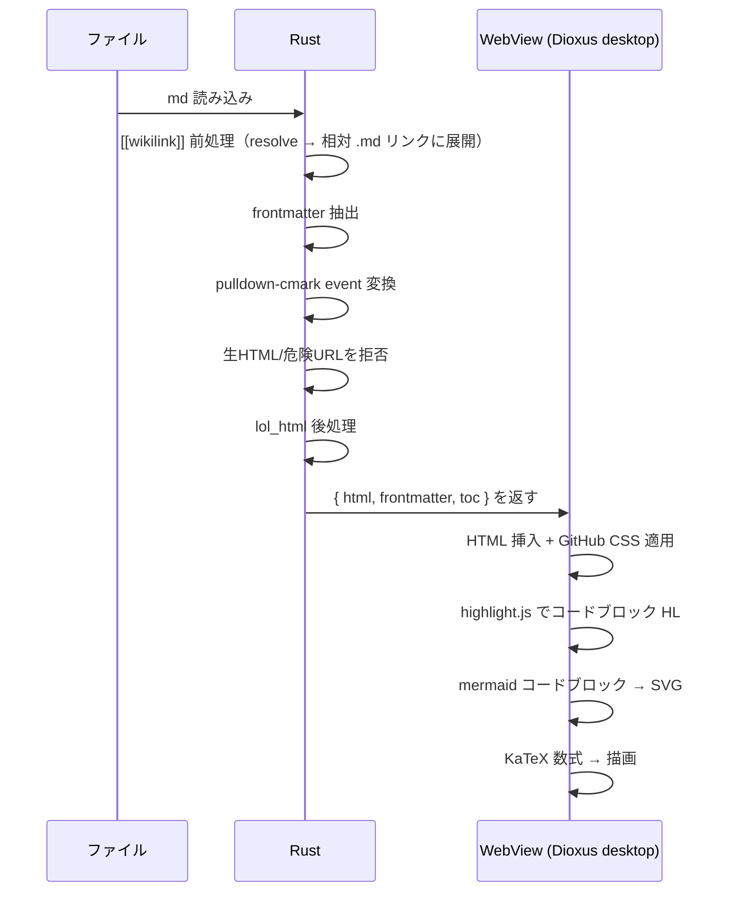
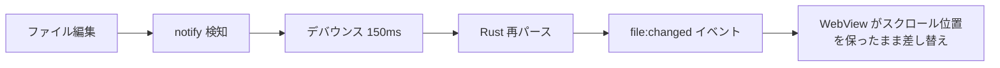

# 06 - レンダリングパイプライン

Markdown を GitHub 忠実に表示するまでの流れ。Rust でパース、WebView で仕上げ。

## 全体フロー



## Rust 側の処理

### Obsidian wikilink 前処理

`markdown::preprocess_wikilinks(source, base_dir, roots)` が `render()` の前に走る。

| 記法 | 変換結果 |
|---|---|
| `[[target]]` | `[target](target.md)` に展開して既存の `.md` リンク経路で遷移 |
| `[[target\|alias]]` | `[alias](target.md)` |
| `[[target#Heading]]` | `[target](target.md#heading-slug)` ファイル遷移のみ（アンカースクロールは v1 未対応） |
| `[[target#Heading\|alias]]` | `[alias](target.md#heading-slug)` |
| `![[image.ext]]` | `` に展開し、画像埋め込み経路（data URL 化）に載せる |
| `![[image.ext\|400]]` | 表示幅指定。`` に展開し、`post_process` が `alt` マーカーを `width="400"` 属性へ変換 |
| `![[image.ext\|説明]]` | ``（`\|` 後が数値でなければ alt テキスト扱い） |
| `![[note.md]]` 等（非画像） | 変更なし（従来どおり素通し） |

画像埋め込みの対象拡張子は png / jpg / jpeg / gif / webp / svg（大文字小文字非依存）。解決順は下記 wikilink と共通。未解決の画像埋め込みはリンクと同様 `.mdo-wikilink-unresolved` へ demote する（alt があれば alt、なければファイル名を表示）。

**解決順:**
1. カレントドキュメントのディレクトリからの相対パス。
2. roots 各々のルートからの相対パス。
3. roots 配下をファイル名（basename）一致で探索（`node_modules` / `target` / `.git` 等はスキップ）。

解決できなかった wikilink は `post_process` が `<a class="mdo-wikilink-unresolved">` に変換し、CSS でミュートカラー＋点線下線を付ける（href は無し）。

セキュリティ: roots 外へのパス解決は拒否し、生成した相対リンクは既存の `post_process` 検証（roots 包含・`.md` 拡張子チェック）を通る。

### pulldown-cmark 設定

GitHub 互換のため以下の拡張を有効化する。

| 拡張 | 用途 |
|---|---|
| table | GFM テーブル |
| strikethrough | 取り消し線 |
| tasklist | チェックボックス |
| footnotes | 脚注 |
| alerts | GitHub Alerts (`> [!NOTE]` 等、現行は前処理) |
| frontmatter | YAML frontmatter 抽出 |

### highlight.js

コードブロックは `language-*` class を持つ HTML として出力し、WebView 側の highlight.js でハイライトする。Mermaid のコードブロックは `<pre class="mermaid">` として出力し、本文は text event として escape する。

### サニタイズ

生 HTML は原則許可しない。ユーザー由来の `Event::Html` / `Event::InlineHtml` は text として escape 表示する。この「全 escape → 再パース」は XSS 防御の要であり崩さない。

#### 生 HTML 許可サブセット（allowlist 再構築）

GitHub README 定番の `<p align="center"></p>` 等を描画するため、**escape を解かず、検証済み属性から自前でタグを再構築する** allowlist 方式を採る（`src/markdown/raw_html.rs`）。

- 段階: `render`（escape）→ **`raw_html::reconstruct_allowed`（post_process 冒頭）** → lol_html 後処理。escape 済み出力の中から `&lt;tag …&gt;` パターンだけを認識し、属性をパースして allowlist 検証し、新しいタグ文字列を組み立てて置換する。元文字列を unescape して流すことは一切しない。
- これにより `onerror=` 等の未許可属性・`<script>` 等の未許可タグは**構造的に**通らない（そもそも emit されない）。
- 再構築した `` は実タグとして lol_html 画像ハンドラに渡り、Markdown 画像とまったく同じ data URL 化・roots 包含検証・lightbox を受ける。
- エンティティ（`&quot;` 等）のデコードは属性値の抽出時のみ行い、再構築時に必ず再 escape する。

| タグ | 許可属性 | 検証 |
|---|---|---|
| `img` | `src`, `alt`, `width`, `height` | `src` は `safe_image_url` でスキーム検証（相対/ローカル・http(s) 可、`javascript:`/`data:`/`//` は非描画=escape のまま）→ ローカルは既存の data URL 化経路。`width`/`height` は数値のみ、非数値は属性を落とす |
| `p`, `div` | `align`(center/left/right) | 値が3種以外なら属性を落とす |
| `br` | なし | void 要素 |
| `kbd`, `sub`, `sup` | なし | — |
| `details`, `summary` | `details` に `open` のみ | — |

- 閉じタグ（`</p>` 等）も対応。上記タグ同士の入れ子は可。
- 許可タグでも未許可属性（`style`/`class`/`id`/`on*` 等）はすべて捨てる。
- 検証に失敗した `img`（`src` 不正・欠落）はタグごと非描画（escape 表示のまま）。
- 対応しない: 未許可タグ全般（`iframe`/`svg`/`style`/`a`/見出し等）、属性値中の生 `<`/`>`。

Markdown URL は scheme を allowlist する。

- link: `http`, `https`, `mailto`, fragment, relative path
- image: `http`, `https`, relative path（png/jpg/jpeg/gif/webp/svg を data URL 化）
- reject: `javascript`, `data`, `file`, protocol-relative URL

相対画像と `.md` link は `lol_html` 後処理で canonicalize し、project root 配下に収まる場合だけ解決する。拒否時は `src` / `href` を削除する。

**対応画像形式:** png / jpg / jpeg / gif / webp / svg。いずれも roots 配下のローカルファイルを base64 data URL 化して `` に埋め込む（8MB 上限）。`http(s)` はそのまま表示。相対 `src` はレンダラが空白・括弧を percent-encode するため、`post_process` は data URL 化前に percent-decode してから実ファイルへ解決する。

**SVG の安全性:** SVG はスクリプトや外部リソースを内包できるが、`data:` URL 経由の `` 読み込みではブラウザ仕様によりそれらは実行・取得されない。mzed は生 HTML を全エスケープして再パースするため inline `<svg>` 経路は存在せず、この data URL `` 経路のみが SVG の到達口となり安全。

Mermaid は `securityLevel: 'strict'` を既定にする。

### 出力構造

```rust
struct RenderResult {
    html: String,            // サニタイズ済み HTML
    frontmatter: Option<serde_yaml::Value>,
    toc: Vec<TocEntry>,      // 見出しツリー
    title: Option<String>,   // frontmatter.title or 先頭 h1
}

struct TocEntry {
    level: u8,
    text: String,
    anchor: String,
    children: Vec<TocEntry>,
}
```

ToC は pulldown-cmark event から見出しを拾って構築する。WebView 側で再パースしない。

## WebView 側の処理

### Mermaid

`<pre class="mermaid">` を走査し、mermaid.js で SVG に変換して差し替える。描画後、SVG を画像コピーできるようにツールバーを付ける（arto 由来、R-14）。

### KaTeX

`renderMathInElement` に渡す delimiter は以下の3種のみ。単一 `$` は通貨・区切り文字との衝突を避けるため **無効**。

| delimiter | 種別 |
|---|---|
| `$$...$$` | ブロック数式 |
| `\(...\)` | インライン数式 |
| `\[...\]` | ブロック数式（代替） |

> **既知の破壊的変更**: v1.0.2 以前の `$x$` 形式インライン数式は動作しなくなる。`\(x\)` に書き換えること。

### 画像・相対リンクの解決

md ファイルの位置を基準に相対パスを解決する。ただし canonical path が許可 root 配下にある場合だけ有効にする。

- 画像 `` → data URL として埋め込む（svg 含む）
- Obsidian 埋め込み `![[img.png]]` / 幅指定 `![[img.png\|400]]` → 標準画像に展開後、同じ data URL 経路で埋め込む
- ドキュメント間リンク `[x](./other.md)` → クリックで mzed 内遷移（R-13）。外部 URL は OS の既定ブラウザで開く

### frontmatter 表示

抽出した YAML を折りたたみテーブルで本文先頭に出す（R-07）。

## ライブリロード



スクロール位置と開いているタブは保持する。再描画は変更ファイルのみ。

## パフォーマンス方針（Zed 由来）

- パース・ハイライトは背景スレッド（`spawn_blocking`）。メインスレッドをブロックしない
- 同一内容の再パースを避けるため、ファイルパス + mtime をキーにレンダリング結果をキャッシュ
- 大きな md はビューポート分だけ描画する仮想スクロールを検討（将来）
