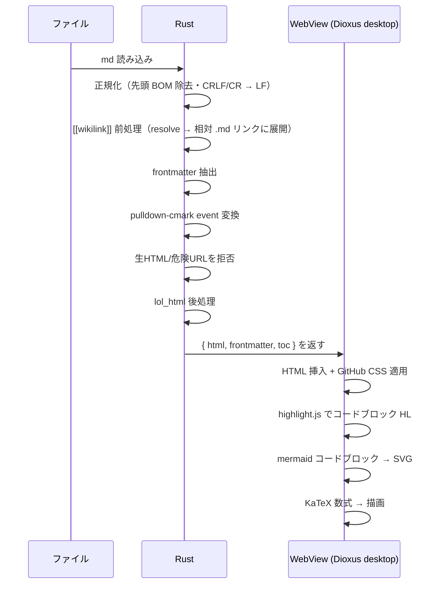
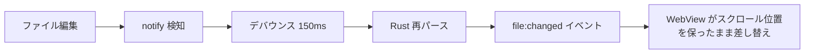

# 06 - レンダリングパイプライン

Markdown を GitHub 忠実に表示するまでの流れ。Rust でパース、WebView で仕上げ。

## 全体フロー


```mermaid
sequenceDiagram
    participant FS as ファイル
    participant BG as Rust
    participant WV as WebView (Dioxus desktop)

    FS->>BG: md 読み込み
    BG->>BG: 正規化（先頭 BOM 除去・CRLF/CR → LF）
    BG->>BG: [[wikilink]] 前処理（resolve → 相対 .md リンクに展開）
    BG->>BG: frontmatter 抽出
    BG->>BG: pulldown-cmark event 変換
    BG->>BG: 生HTML/危険URLを拒否
    BG->>BG: lol_html 後処理
    BG->>WV: { html, frontmatter, toc } を返す
    WV->>WV: HTML 挿入 + GitHub CSS 適用
    WV->>WV: highlight.js でコードブロック HL
    WV->>WV: mermaid コードブロック → SVG
    WV->>WV: KaTeX 数式 → 描画
```

## Rust 側の処理

### 入力の正規化（BOM / 改行）

`markdown::normalize_source(source)` が wikilink 前処理より前に走り、後続の行指向処理を安定させる。

- 先頭の UTF-8 BOM（`U+FEFF`）を除去する。BOM が残ると `---\n` 判定が外れて frontmatter が本文に漏れる。
- `CRLF` および単独 `CR` を `LF` に変換する。Windows 由来ファイルでも frontmatter / GitHub Alerts / wikilink 前処理が正しく動く。
- 正規化結果は render / toc / find インデックスに使う。クリップボード・raw 表示用の元ソースはバイト等価のまま保持する。

### 裸 URL の自動リンク（autolink）

pulldown-cmark に GFM の autolink 拡張は無いため、`render()` 内の後処理パス（`autolink_pass`）で実装している。GFM 準拠で3種を `<a>` に変換する: `http(s)://…`、`www.…`（href は `http://` 前置）、裸のメールアドレス（href は `mailto:` 前置。ドメインに `.` が必要）。`:emoji:` ショートコードは GFM 仕様外のため対象外。

- コードブロック・インラインコード・既存リンク内は対象外
- pulldown が強調候補文字（`_` 等）で Text イベントを分割するため、連続 Text をマージしてから linkify する（URL が途中で切れるのを防ぐ）
- URL は ASCII の URL 文字集合のみで構成（日本語文が空白なしで続いても正しく終端する）。末尾の句読点は除外、閉じ括弧は URL 内の `(` とバランスする分だけ保持（Wikipedia 形式対応）
- 生成リンクは http(s) 限定なので既存の URL 検証と整合。クリックは外部ブラウザで開く既存経路

### Obsidian wikilink 前処理

`markdown::preprocess_wikilinks(source, base_dir, roots)` が `render()` の前に走る。

| 記法 | 変換結果 |
|---|---|
| `[[target]]` | `[target](target.md)` に展開して既存の `.md` リンク経路で遷移 |
| `[[target\|alias]]` | `[alias](target.md)` |
| `[[target#Heading]]` | `[target](target.md#heading-slug)` ファイル遷移のみ（アンカースクロールは v1 未対応） |
| `[[target#Heading\|alias]]` | `[alias](target.md#heading-slug)` |
| `![[image.ext]]` | `` に展開し、画像埋め込み経路（data URL 化）に載せる |
| `![[image.ext\|400]]` | 表示幅指定。`` に展開し、`post_process` が `alt` マーカーを `width="400"` 属性へ変換 |
| `![[image.ext\|説明]]` | ``（`\|` 後が数値でなければ alt テキスト扱い） |
| `![[note.md]]` 等（非画像） | 変更なし（従来どおり素通し） |

画像埋め込みの対象拡張子は png / jpg / jpeg / gif / webp / svg（大文字小文字非依存）。解決順は下記 wikilink と共通。未解決の画像埋め込みはリンクと同様 `.mdo-wikilink-unresolved` へ demote する（alt があれば alt、なければファイル名を表示）。

**解決順:**
1. カレントドキュメントのディレクトリからの相対パス。
2. roots 各々のルートからの相対パス。
3. roots 配下をファイル名（basename）一致で探索（`node_modules` / `target` / `.git` 等はスキップ）。

解決できなかった wikilink は `post_process` が `<a class="mdo-wikilink-unresolved">` に変換し、CSS でミュートカラー＋点線下線を付ける（href は無し）。

セキュリティ: roots 外へのパス解決は拒否し、生成した相対リンクは既存の `post_process` 検証（roots 包含・markdown 拡張子チェック）を通る。内部リンク扱いにする拡張子はサイドバー/オープン許可（`files::is_markdown`）と揃え、`.md` / `.markdown`（大文字小文字非依存）を対象とする。

レンダラに渡す roots は「プロジェクト roots ＋ 単体ファイルの描画専用 root（`loose_roots`）」。ドラッグ & ドロップや IPC でプロジェクト外の md を開いたとき、そのファイルの親ディレクトリだけが描画専用 root として加わり、相対画像・リンクが解決できる。サイドバーツリー・ファイル監視・Task View・パレットはプロジェクト roots のみを見る（ドロップでプロジェクトが汚れない）。描画専用 root はセッション永続化の対象外。

### pulldown-cmark 設定

GitHub 互換のため以下の拡張を有効化する。

| 拡張 | 用途 |
|---|---|
| table | GFM テーブル |
| strikethrough | 取り消し線 |
| tasklist | チェックボックス |
| footnotes | 脚注 |
| alerts | GitHub Alerts (`> [!NOTE]` 等、現行は前処理) |
| frontmatter | YAML frontmatter 抽出 |

### highlight.js

コードブロックは `language-*` class を持つ HTML として出力し、WebView 側の highlight.js でハイライトする。Mermaid のコードブロックは `<pre class="mermaid">` として出力し、本文は text event として escape する。

### サニタイズ

生 HTML は原則許可しない。ユーザー由来の `Event::Html` / `Event::InlineHtml` は text として escape 表示する。この「全 escape → 再パース」は XSS 防御の要であり崩さない。

#### 生 HTML 許可サブセット（allowlist 再構築）

GitHub README 定番の `<p align="center"></p>` 等を描画するため、**escape を解かず、検証済み属性から自前でタグを再構築する** allowlist 方式を採る（`src/markdown/raw_html.rs`）。

- 段階: `render`（escape）→ **`raw_html::reconstruct_allowed`（post_process 冒頭）** → lol_html 後処理。escape 済み出力の中から `&lt;tag …&gt;` パターンだけを認識し、属性をパースして allowlist 検証し、新しいタグ文字列を組み立てて置換する。元文字列を unescape して流すことは一切しない。
- これにより `onerror=` 等の未許可属性・`<script>` 等の未許可タグは**構造的に**通らない（そもそも emit されない）。
- 再構築した `` は実タグとして lol_html 画像ハンドラに渡り、Markdown 画像とまったく同じ data URL 化・roots 包含検証・lightbox を受ける。
- エンティティ（`&quot;` 等）のデコードは属性値の抽出時のみ行い、再構築時に必ず再 escape する。

| タグ | 許可属性 | 検証 |
|---|---|---|
| `img` | `src`, `alt`, `width`, `height` | `src` は `safe_image_url` でスキーム検証（相対/ローカル・http(s) 可、`javascript:`/`data:`/`//` は非描画=escape のまま）→ ローカルは既存の data URL 化経路。`width`/`height` は数値のみ、非数値は属性を落とす |
| `p`, `div` | `align`(center/left/right) | 値が3種以外なら属性を落とす |
| `br` | なし | void 要素 |
| `kbd`, `sub`, `sup` | なし | — |
| `details`, `summary` | `details` に `open` のみ | — |

- 閉じタグ（`</p>` 等）も対応。上記タグ同士の入れ子は可。
- 許可タグでも未許可属性（`style`/`class`/`id`/`on*` 等）はすべて捨てる。
- 検証に失敗した `img`（`src` 不正・欠落）はタグごと非描画（escape 表示のまま）。
- 対応しない: 未許可タグ全般（`iframe`/`svg`/`style`/`a`/見出し等）、属性値中の生 `<`/`>`。

Markdown URL は scheme を allowlist する。

- link: `http`, `https`, `mailto`, fragment, relative path
- image: `http`, `https`, relative path（png/jpg/jpeg/gif/webp/svg を data URL 化）
- reject: `javascript`, `data`, `file`, protocol-relative URL

相対画像と `.md` link は `lol_html` 後処理で canonicalize し、project root 配下に収まる場合だけ解決する。拒否時は `src` / `href` を削除する。

**対応画像形式:** png / jpg / jpeg / gif / webp / svg。いずれも roots 配下のローカルファイルを base64 data URL 化して `` に埋め込む（8MB 上限）。`http(s)` はそのまま表示。相対 `src` はレンダラが空白・括弧を percent-encode するため、`post_process` は data URL 化前に percent-decode してから実ファイルへ解決する。

**SVG の安全性:** SVG はスクリプトや外部リソースを内包できるが、`data:` URL 経由の `` 読み込みではブラウザ仕様によりそれらは実行・取得されない。mzed は生 HTML を全エスケープして再パースするため inline `<svg>` 経路は存在せず、この data URL `` 経路のみが SVG の到達口となり安全。

Mermaid は `securityLevel: 'strict'` を既定にする。

### 出力構造

```rust
struct RenderResult {
    html: String,            // サニタイズ済み HTML
    frontmatter: Option<serde_yaml::Value>,
    toc: Vec<TocEntry>,      // 見出しツリー
    title: Option<String>,   // frontmatter.title or 先頭 h1
}

struct TocEntry {
    level: u8,
    text: String,
    anchor: String,
    children: Vec<TocEntry>,
}
```

ToC は pulldown-cmark event から見出しを拾って構築する。WebView 側で再パースしない。

## WebView 側の処理

### Mermaid

`<pre class="mermaid">` を走査し、mermaid.js で SVG に変換して差し替える。描画後、SVG を画像コピーできるようにツールバーを付ける（arto 由来、R-14）。

**設定の供給元:** `mermaid.initialize` に渡す設定は `src/js/mermaid.rs` の `init_config_json(dark)` が唯一の出所で、インライン表示・ポップアウト窓・HTML エクスポート・`mzed serve` の 4 経路すべてが同じ `MDO_MERMAID` ヘルパ経由でこれを使う。`securityLevel: 'strict'` と `htmlLabels: false` はこの 1 箇所で決まる。

**mindmap の扱い:** mindmap だけは他の図と別の `initialize` + `run` パスで描画する。理由は 2 つ。

- 配色: mzed は mindmap のセクション色を `cScale0..11` / `cScaleLabel0..11`（+ root 用の `git0` / `gitBranchLabel0`）で固定する。これらの theme variable は pie / gitGraph とも共有されるため、mindmap だけを別パスで描くことで他の図種に影響させない。色は light / dark とも文字・背景のコントラスト比 4.5:1 以上を満たす。
- ソース側の色指定: ソースが色を差し込める口は 2 つある。`%%{init: ...}%%` ディレクティブ（`mermaid.initialize` より後に適用されるため放置すると mzed のプリセットに勝つ）と、YAML frontmatter の `config.themeVariables`。mindmap のソースからは描画前に **両方とも** 取り除く。frontmatter は該当キーだけでなくブロックごと落とす（WebView に YAML パーサを持ち込まずに済み、mindmap のレンダラは frontmatter から何も描画しないため）。mindmap 以外の図はどちらもそのまま尊重する。

図種の判定は mermaid 同梱の `detectType` と同じ前処理（frontmatter・`%%{...}%%` ディレクティブ・`%%` コメントを除去してから図種キーワードを見る）で行う。使う正規表現は `src/js/mermaid.rs` に定数として置き、同梱 mermaid のソースと一致することをテストで固定する（mermaid を上げて前処理が変わったらテストが落ちる）。

`mermaid.initialize` はグローバル設定を書き換えるため、`initialize` → `run` の 1 組は次の 1 組が始まる前に終わる必要がある。`serve` の連続ロードなどで描画要求が重なっても混ざらないよう、描画全体を `window.__mdoMermaidQueue` の 1 本の Promise チェーンで直列化する。

**描画は別文書で行う:** mermaid は図を 1 枚描くたびに、寸法計測用の作業 `<div>`（中に図の `<style>` を含む）を文書から取り除く。本文と同じ文書でこれが起きると、WebKit はスタイルを組み直して文書全体をレイアウトし直す。5MB の文書では 1 回 2.2 秒かかり、図の枚数だけ繰り返していた（Mermaid 30 図で初回描画 72 秒）。`contain: strict` の囲いを使っても止まらない（組み直しは文書全体のスタイルに及ぶため）。

そこで `MDO_MERMAID` は、隠した同一オリジンの `<iframe>`（ウィンドウごとに 1 つ、初回に本文と同じ `mermaid.min.js` を読み込む）の中の mermaid で描く。iframe は描画する文書を分けるためのもので、権限は分けていない（同一オリジンで `sandbox` 属性なし。安全性は従来どおり `securityLevel: 'strict'` と mermaid のサニタイズに依る）。

- 図ごとに iframe 内へ作業用の `<pre>`（stage）を置く。stage には元の `pre.mermaid` の内容幅と、表示・フレックス配置・文字関係の計算済みスタイルを写す。gantt は親の幅から、カード内の `pre` は中央寄せのフレックスとして寸法を決めるので、元の場所で描いたときと同じ計測になる。
- 描画に成功した図だけ、stage の子ノード（mermaid がサニタイズ済みの SVG）を元の `pre` へ `replaceChildren` で移し、`data-processed` を付ける。mermaid が例外を出した図は何も移さず、元の `pre` がソースのまま残る（`data-processed` も付かず、キャッシュにも入らない。次の再描画で再試行）。本文側に HTML 文字列の差し込み口は増やさない。`securityLevel: 'strict'` もそのまま。
- `data-processed` 付きの `pre` は、`mermaid.run` と同じく描かずに飛ばす。
- 通常の図は最初の 3 枚が描けた時点でいったん本文へ移し、残り（mindmap を含む）はまとめて移す。長い文書の先頭の図が全体を待たずに出る（`big.md` で最初の 3 枚が約 0.5 秒、30 枚で約 1.3 秒）。
- `arrowMarkerAbsolute` を有効にした図は、矢印マーカーの参照が「描いた文書の URL + `#id`」になる。iframe の URL は `about:blank` なので、移す前に `marker-start` / `marker-mid` / `marker-end` の参照を `url(#id)` に直す（本文の URL の絶対参照と同じ要素を指す）。
- iframe を用意できないとき（mermaid の `<script>` が見つからない、読み込みに失敗した、読み込めたが `mermaid` が定義されない）と、iframe 側の mermaid が描画中に使えなくなったとき（`initialize` が例外を出す）は、その iframe を捨て、本文の文書に stage を置いて同じ手順で描く（速くはならないが表示は同じ）。捨てた iframe は再利用せず、次の描画で作り直す。

既知の差: `arrowMarkerAbsolute` を有効にした flowchart だけ、SVG の表示高さが viewBox より約 9px 高くなり、カードの下の余白が増える（矢印と図の中身は同じ。WebKit で、移した SVG の高さが再レイアウトされるまで古い値のまま残る。原因は未特定）。

実測（`big.md`: 5.2MB、コード 300・Mermaid 30、`just bundle` した .app、ダーク）: 初回描画の後処理は 72.3 秒 → 1.5 秒。50KB に同じ 30 図だけを置いた文書では 1.8 秒 → 0.9 秒。

**mindmap ラベルの中央寄せ:** `htmlLabels: false` では、mermaid 11 は図形側が要求したときだけノードラベルを水平中央に寄せる。mindmap が流用する汎用シェイプ（circle / rect / rounded / hexagon）はこれを要求しないため、ラベル group が `translate(0, -h/2)` のまま残り、テキストがノードの右にはみ出す（`root((…))` で最も目立つ）。この transform を選択する `themeCSS` で `text-anchor: middle` を当てて補正する。自前で中央寄せするシェイプ（bang / cloud / 装飾なしノード）は `-w/2` を書くため、この選択子には当たらない。

**インライン図のズーム / パン:** インラインカード（`.mdo-mermaid`）は ⌘+ホイール（トラックパッドのピンチを含む）でカーソル基準ズーム、ドラッグでパン、ダブルクリックで等倍に戻る。修飾キーなしのホイールはページスクロールのまま通す。ズーム状態は図ごとに持ち、再描画（テーマ切替・ライブリロード）で等倍に戻る。ズーム / パンの実装 `mdoZoomPan` はポップアウト窓と共有する（ポップアウトは修飾キーなしでズームし、ダブルクリックは全体表示）。

カーソル基準ズームの座標は、変形対象（`pre.mermaid`）の未変形原点から測る。カードの padding + border の分だけ内側にあるため、カード原点から測るとアンカーがずれる。

ポップアウトを起こすクリックの扱いは 2 つ。ドラッグ後の mouseup はクリックと区別してポップアウトしない（移動量 4px しきい値）。ダブルクリックは先に click が 2 回飛ぶため、単クリックの送信を 250ms 遅らせ、その間に dblclick が来たら取り消す。

**エクスポート:** 複製した DOM からはカードの inline style に加えて `pre.mermaid` の transform も落とす。エクスポート先にはパンするビューポートが無いので、拡大したままだとカードの `overflow: hidden` で欠ける。

### KaTeX

`renderMathInElement` に渡す delimiter は以下の3種のみ。単一 `$` は通貨・区切り文字との衝突を避けるため **無効**。

| delimiter | 種別 |
|---|---|
| `$$...$$` | ブロック数式 |
| `\(...\)` | インライン数式 |
| `\[...\]` | ブロック数式（代替） |

> **既知の破壊的変更**: v1.0.2 以前の `$x$` 形式インライン数式は動作しなくなる。`\(x\)` に書き換えること。

### 再描画時の再処理キャッシュ（highlight.js / Mermaid）

ライブリロードとタブ切替はペイン本文の HTML を全置換する（差分 DOM 更新は別設計で、今は採らない）。置換後の後処理で、内容が変わっていないコードブロックと図まで作り直さないよう、WebView 側に仕上がりをソースごとに覚えておく。

| 対象 | キー | 覚えるもの | 上限 |
|---|---|---|---|
| コードブロック（`window.__mdoHlCache`） | `code` の class（言語）+ 本文テキスト | ハイライト済みの innerHTML と class | 500 件 |
| Mermaid（`window.__mdoMermaidCache`） | 元ソース（`data-mdo-src`）+ ダーク/ライト | 描画済み SVG（`pre` の innerHTML） | 50 件 |

- 上限を超えたら最後に使ってから最も長いものを捨てる（LRU）。件数に加えて、キャッシュごとにキーと値の文字数の合計が 4M 文字を超えても古いものから捨てる。キー + 値で 1M 文字を超える 1 件は覚えない。キャッシュはウィンドウの WebView が生きている間だけ持ち、永続化しない。
- 同じキーなら highlight.js / mermaid を呼ばずに差し込む。Mermaid のズーム / パン結線とツールバーはカードに付くので、差し込み後もそのまま効く（再描画時は等倍に戻る）。
- テーマはキーに含むので、ライト / ダーク切替では切替先で初めて見る図だけが描き直される。
- 覚えるのは描画の成功が確定した図だけ。成功すると `mermaid.run` は `pre` の中身をちょうど 1 個の `<svg>`（`aria-roledescription` に図種）に置き換える。失敗した図は `pre` にソース文字列と mermaid の作業用 `<div>`（エラー図入り。ARIA 属性が付かない経路もある）が残るので、この形にならない。失敗した図は次の再描画で再試行する。
- ウィンドウが非表示（`document.hidden`）のとき、または SVG の表示寸法の幅か高さが 0 のときに描いた図も覚えない（寸法を誤ったまま残さないため）。
- KaTeX は毎回 `renderMathInElement` を掛け直す（計測で主因ではなかった）。

実測（`big.md`: 5.2MB、コード 300・Mermaid 30、`just bundle` した .app、ダーク・KaTeX 有効）: 保存後の後処理は修正前 65.4 秒 → 修正後 0.1〜0.3 秒。初回表示（キャッシュが空）は、上の「描画は別文書で行う」で約 69 秒 → 1.5 秒。

### ファイル内検索（Cmd+F）

CSS Custom Highlight API で一致箇所に色を付ける（本文 DOM は書き換えない）。

- 入力は 60ms の debounce を挟んでから走査する。一致件数（Rust 側）も同じタイミングで更新する。
- 一致位置はテキストノード単位で全件数えるが、`Range` を作って `Highlight` に登録するのは現在の一致の前後 500 件（最大 1,001 件）だけ。次 / 前へ移動するたびに現在位置を中心に作り直すので、窓の外へ進んでも色は付いて見える。1 文字クエリのように数万件当たる文書で、入力のたびに数万個の Range を作らないため。
- 件数表示は全件のまま。

### 画像・相対リンクの解決

md ファイルの位置を基準に相対パスを解決する。ただし canonical path が許可 root 配下にある場合だけ有効にする。

- 画像 `` → data URL として埋め込む（svg 含む）
- Obsidian 埋め込み `![[img.png]]` / 幅指定 `![[img.png\|400]]` → 標準画像に展開後、同じ data URL 経路で埋め込む
- ドキュメント間リンク `[x](./other.md)` / `[x](./note.markdown)` → クリックで mzed 内遷移（R-13）。`.md` / `.markdown`（大文字小文字非依存）が対象
- 外部 URL（`http(s)://` / `mailto:`）は WebView 側ブリッジ経由で OS の既定アプリ（ブラウザ・メールクライアント）で開く。`mailto:` も external 経路に乗り、`external_links_in_browser` 設定に従う

### frontmatter 表示

抽出した YAML を折りたたみテーブルで本文先頭に出す（R-07）。

## ライブリロード


```mermaid
flowchart LR
    Edit[ファイル編集] --> Notify[notify 検知]
    Notify --> Debounce[デバウンス 150ms]
    Debounce --> Rerender[Rust 再パース]
    Rerender --> Emit[file:changed イベント]
    Emit --> Patch[WebView がスクロール位置を保ったまま差し替え]
```

スクロール位置と開いているタブは保持する。再描画は変更ファイルのみ。

### サイドバー更新の発火条件

サイドバーは**ツリーの形が変わったときだけ**再スキャンする。`watcher::tree_affected` がイベント種別とパスの両方で判定する。

- 種別: `Create` / `Remove` / `Modify(Name)` のみ。`Modify(Data)` / `Modify(Metadata)`（＝ふつうの保存）は対象外
- パス: root 配下で、祖先に無視ディレクトリ（`.` 始まり、`node_modules`、`target`、`dist`、`build`）を含まないもの。そのうえで
  - 実在するディレクトリ → 自身の名前も無視判定にかける（`.cache.md/` が md ファイルに見えるのを防ぐ）
  - 実在するファイル → md（`.md` / `.markdown`）のみ
  - **すでに消えているパス → 拡張子で判断せず、常に構造変化として扱う**

3 番目が重要。削除やリネーム元は `stat` できず、FSEvents はリネームに file/folder ヒントを付けない（`RenameMode::Any`）。拡張子で判断すると `docs.v1/` を `target/docs.v1/` へ移動したとき、旧側は「拡張子あり＝ファイル」で捨てられ、新側は無視領域で捨てられ、**サイドバーが黙って古いまま**になる。非 md ファイルの削除で 1 回余分に再スキャンが走るほうが安い。

保存のたびに再スキャンすると `trees` シグナルが一度空になってから埋め直され、サイドバーがちらつく。ツリーが持つのは名前だけなので、内容変更で作り直す理由がない。

監視は root ごとに **1 つの再帰 watcher**（`RecursiveMode::Recursive`）。起動後に作られたサブフォルダも watcher を足さずに拾える。無視ディレクトリは「監視しない」のではなく判定側で捨てる。

debouncer の file-id キャッシュは使わない（`NoCache`）。再帰 root の追加時にツリー全体を `stat` するため、`target/` が育った Rust プロジェクトで約 10 秒かかる。キャッシュの用途はリネームの From/To を突き合わせることだけで、この watcher はどちらか片方が届けば十分。

再スキャン中もサイドバーは**旧ツリーを表示したまま**にする。`trees` シグナルを空にするのは roots 自体が変わったとき（プロジェクト切替）だけで、`build_tree_overlay` の完了時に世代カウンタ（`app_state::generation`）で古い結果を弾いてから差し替える。空にしてから埋め直すと、フォーカス復帰やパレット開閉のたびにサイドバーが 1 フレーム消える。

制約:

- FSEvents は同一パスに数秒以内で起きた操作のフラグをまとめることがある。作った直後に消したフォルダの削除が `Remove` として届かない場合があるが、間隔が空けば届く。
- `NoCache` にしても debouncer は `Modify(Name(Any))` ごとに `Path::exists()` を呼ぶ。`target/` 配下で大量にリネームが起きると、アプリ側の無視判定より先にこの syscall が走る。実害は未計測。

### パス綴りの正規化（必須）

FSEvents は**完全に解決されたパス**（symlink 展開、`/tmp` → `/private/tmp` などの firmlink 展開、ディスク上の大小文字）で通知する。一方アプリが持つのは CLI 引数・Zed の DB・symlink 経由のサイドバーが与えた綴りで、両者は一致しないことがある。

そのため監視側の一致判定（`watcher::active_file_affected` / `tree_affected`）は、**両辺を canonicalize してから大小文字を無視して比較する**。ファイル自体が消えている場合（削除・リネーム）は親ディレクトリを canonicalize してファイル名を付け直す。`tree_affected` は通知されたパスをまず素のまま root と突き合わせ、外れたときだけ canonicalize する（ビルド中の `target/` のような大量イベントで syscall を使わないため）。

これを verbatim 比較にすると、症状は「そのファイルだけライブリロードもサイドバー更新も**黙って効かない**」になる（エラーも出ない）。symlink を張った docs ディレクトリ、`/tmp` 配下、ホームディレクトリの綴り違いで実際に踏む。

## パフォーマンス方針（Zed 由来）

- パース・ハイライトは背景スレッド（`spawn_blocking`）。メインスレッドをブロックしない
- 同一内容の再パースを避けるため、ファイルパス + mtime をキーにレンダリング結果をキャッシュ
- 大きな md はビューポート分だけ描画する仮想スクロールを検討（将来）
