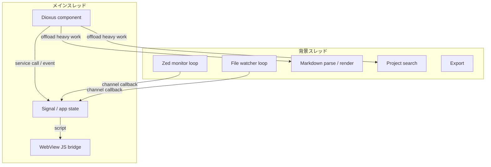
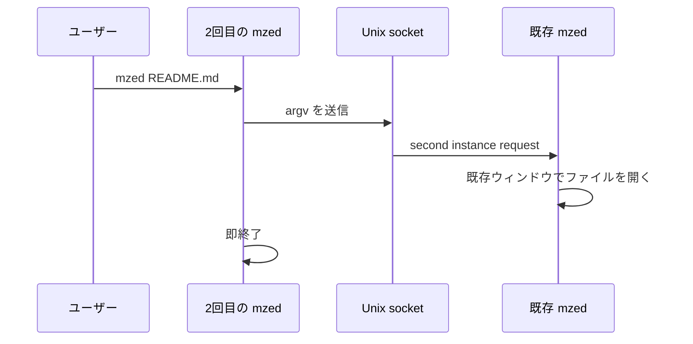

# 07 - UI ブリッジと並行性

Dioxus desktop 上の UI、WebView JS、背景処理、状態管理の境界を定義する。

## スレッドモデル

メインスレッドは UI と軽量な状態遷移に限定し、I/O、監視、重いパース、検索は背景へ逃がす。



- ファイル I/O、tree scan、Markdown render、全文検索は UI event handler 内で長時間同期実行しない。
- ファイル監視と Zed 監視は `WatchSubscription` が stop channel と worker join handle を所有する。
- stop check は高頻度、DB poll は低頻度に分け、終了時に不要な最大待ち時間を作らない。
- `.await` をまたぐ共有状態は必要最小限にし、読み多めのキャッシュは `RwLock` を使う。
- background 結果には generation ID を付け、古い結果で新しい状態を上書きしない。

## UI から呼ぶ操作

| 操作 | 入力 | 戻り | 所有境界 |
|---|---|---|---|
| `render_markdown_file` | `path, options` | `RenderedFile` | `services::file_service` |
| `list_project_files` | `root` | `Vec<TreeNode>` | `files` / `file_service` |
| `read_file_text` | `path` | `String` | `file_service` |
| `rename_path` | `old_path, new_name` | `PathBuf` | `file_service` |
| `watch_tree` | `root` | `WatchSubscription<TreeEvent>` | `watch_service` |
| `watch_file` | `path` | `WatchSubscription<PathBuf>` | `watch_service` |
| `watch_zed_projects` | `mode` | `WatchSubscription<PathBuf>` | `watch_service` |
| `open_external` | `url/path` | `Result<()>` | `platform` |
| `export_html` | `path, dest` | `Result<()>` | `file_service` |

component は service の公開 API を呼び、filesystem、DB query、watcher 起動、OS API の詳細を直接持たない。

## WebView JS bridge

Rust から WebView へ渡す JS は `src/js/` が所有する。

- Markdown 本文、検索語、path、keymap は JSON encode して埋め込む。
- component 側に ad hoc な文字列置換を残さない。
- DOM 操作は post-render、find、keyboard、Mermaid window など用途別に分ける。
- JS bridge は Dioxus component と browser DOM の境界であり、Tauri IPC ではない。

## イベント一覧

| イベント | ペイロード | 発火元 |
|---|---|---|
| `zed_project_changed` | `PathBuf` | Zed monitor |
| `file_changed` | `PathBuf` | file watcher |
| `tree_changed` | `TreeEvent` | file watcher |
| `second_instance` | `OpenTarget` | single-instance socket |
| `render_finished` | `RenderedFile` | markdown render |
| `search_finished` | `Vec<SearchMatch>` | project search |

イベント名は Rust の enum / callback 名として管理し、文字列イベントを component に散らさない。

## 状態管理

```rust
struct AppModel {
    active_project: Option<PathBuf>,
    active_file: Option<PathBuf>,
    tabs: Vec<Tab>,
    render_cache: RenderCache,
    subscriptions: Vec<WatchSubscription<Event>>,
}
```

- UI local state と app state を分ける。
- project、pane、tab、overlay、設定、session の状態遷移は app state 側へ寄せる。
- service は UI state に依存しない。
- watch subscription は state の所有物として drop で確実に停止する。

## シングルインスタンス



既存プロセスとの通信は `interprocess` の Unix socket + JSON Lines で扱う。

ソケットはバインド直後にパーミッションを **0o600（owner 専用 rw）** に設定し、同一システム上の他ユーザーからの接続を遮断する。

- IPC 経由の `Open` メッセージに含まれるパスは `path.is_file() && is_markdown(path)` で検証し、非 .md ファイルや存在しないパスは無視する。
- 1メッセージは 64 KiB 以下、1接続あたり最大 128 メッセージまで受け取る。
- 2回目以降の起動で複数ファイルを渡す場合は `OpenMany` にまとめ、1 message あたり最大 128 paths / 64 KiB を超えないようにチャンク化する。送信前 validation に失敗した場合は部分送信しない。
- 同時接続は最大 32。上限超過時は新しい接続を処理しない。
- socket worker から UI window へのルーティングは bounded queue を使い、未登録 window 向け pending も最大 128 件に制限する。queue が満杯の場合は新着 IPC message を捨て、UI thread をブロックしない。
- IPC 経由の `NewWindow` は短時間の連打を落とす。ユーザー操作の Cmd+N は通常の UI 操作として扱う。

## ショートカット

| ショートカット | 動作 |
|---|---|
| Cmd+Shift+P | コマンドパレット開閉 |
| Cmd+F | ファイル内検索 |
| Cmd++ / Cmd+- | ズーム |

ショートカットは Dioxus / WebView の入力イベントとして扱い、アプリ非フォーカス時に OS global shortcut を奪う設計にしない。

## エラーハンドリング方針

- service は `Result<T, AppError>` を返す。
- ファイル不在、パース失敗、DB ロックは握りつぶさず、UI が表示できる形に変換する。
- 監視ループ内のエラーはログに残し、可能ならループを継続する。
- 背景タスクのキャンセルは正常系として扱い、終了待ちできる所有構造にする。
