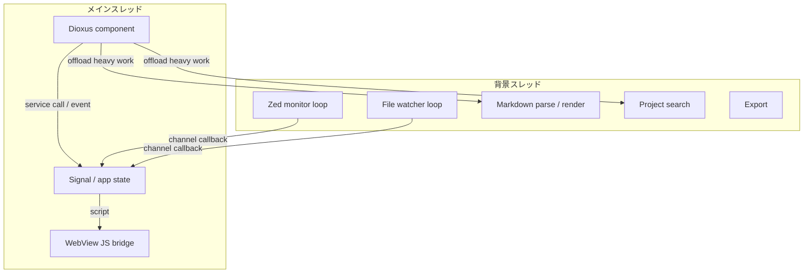
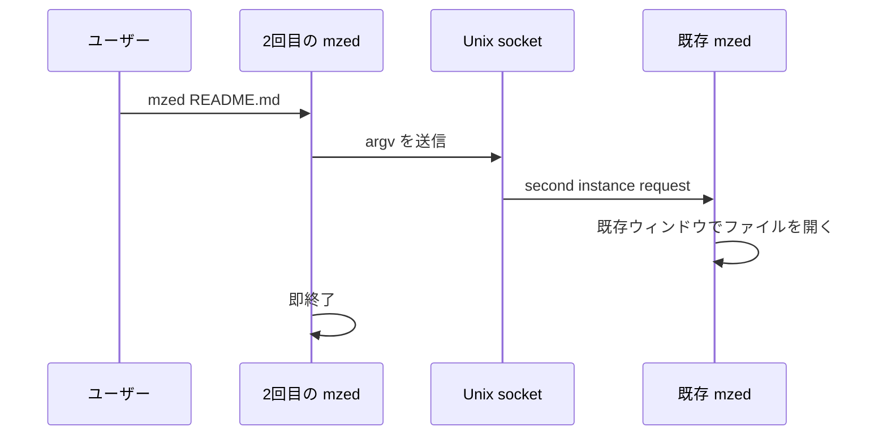

# 07 - UI ブリッジと並行性

Dioxus desktop 上の UI、WebView JS、背景処理、状態管理の境界を定義する。

## スレッドモデル

メインスレッドは UI と軽量な状態遷移に限定し、I/O、監視、重いパース、検索は背景へ逃がす。


```mermaid
flowchart TB
    subgraph Main["メインスレッド"]
        UI[Dioxus component]
        STATE[Signal / app state]
        JS[WebView JS bridge]
    end
    subgraph BG["背景スレッド"]
        ZED[Zed monitor loop]
        WATCH[File watcher loop]
        PARSE[Markdown parse / render]
        SEARCH[Project search]
        EXPORT[Export]
    end
    UI -->|service call / event| STATE
    STATE -->|script| JS
    ZED -->|channel callback| STATE
    WATCH -->|channel callback| STATE
    UI -->|offload heavy work| PARSE
    UI -->|offload heavy work| SEARCH
```

- ファイル I/O、tree scan、Markdown render、全文検索は UI event handler 内で長時間同期実行しない。
- ファイル監視と Zed 監視は `WatchSubscription` が stop channel と worker join handle を所有する。
- stop check は高頻度、DB poll は低頻度に分け、終了時に不要な最大待ち時間を作らない。
- `.await` をまたぐ共有状態は必要最小限にし、読み多めのキャッシュは `RwLock` を使う。
- background 結果には generation ID を付け、古い結果で新しい状態を上書きしない。

## UI から呼ぶ操作

| 操作 | 入力 | 戻り | 所有境界 |
|---|---|---|---|
| `render_markdown_file` | `path, options` | `RenderedFile` | `services::file_service` |
| `list_project_files` | `root` | `Vec<TreeNode>` | `files` / `file_service` |
| `read_file_text` | `path` | `String` | `file_service` |
| `rename_path` | `old_path, new_name` | `PathBuf` | `file_service` |
| `watch_tree` | `root` | `WatchSubscription<TreeEvent>` | `watch_service` |
| `watch_file` | `path` | `WatchSubscription<PathBuf>` | `watch_service` |
| `watch_zed_projects` | `mode` | `WatchSubscription<PathBuf>` | `watch_service` |
| `open_external` | `url/path` | `Result<()>` | `platform` |
| `export_html` | `path, dest` | `Result<()>` | `file_service` |

component は service の公開 API を呼び、filesystem、DB query、watcher 起動、OS API の詳細を直接持たない。

## WebView JS bridge

Rust から WebView へ渡す JS は `src/js/` が所有する。

- Markdown 本文、検索語、path、keymap は JSON encode して埋め込む。
- component 側に ad hoc な文字列置換を残さない。
- DOM 操作は post-render、find、keyboard、Mermaid window など用途別に分ける。
- JS bridge は Dioxus component と browser DOM の境界であり、Tauri IPC ではない。

## イベント一覧

| イベント | ペイロード | 発火元 |
|---|---|---|
| `zed_project_changed` | `PathBuf` | Zed monitor |
| `file_changed` | `PathBuf` | file watcher |
| `tree_changed` | `TreeEvent` | file watcher |
| `second_instance` | `OpenTarget` | single-instance socket |
| `render_finished` | `RenderedFile` | markdown render |
| `search_finished` | `Vec<SearchMatch>` | project search |

イベント名は Rust の enum / callback 名として管理し、文字列イベントを component に散らさない。

## 状態管理

```rust
struct AppModel {
    active_project: Option<PathBuf>,
    active_file: Option<PathBuf>,
    tabs: Vec<Tab>,
    render_cache: RenderCache,
    subscriptions: Vec<WatchSubscription<Event>>,
}
```

- UI local state と app state を分ける。
- project、pane、tab、overlay、設定、session の状態遷移は app state 側へ寄せる。
- service は UI state に依存しない。
- watch subscription は state の所有物として drop で確実に停止する。

## シングルインスタンス


```mermaid
sequenceDiagram
    participant U as ユーザー
    participant S2 as 2回目の mzed
    participant IPC as Unix socket
    participant S1 as 既存 mzed

    U->>S2: mzed README.md
    S2->>IPC: argv を送信
    IPC->>S1: second instance request
    S1->>S1: 既存ウィンドウでファイルを開く
    S2->>S2: 即終了
```

既存プロセスとの通信は `interprocess` の Unix socket + JSON Lines で扱う。

ソケットはバインド直後にパーミッションを **0o600（owner 専用 rw）** に設定し、同一システム上の他ユーザーからの接続を遮断する。

- IPC 経由の `Open` メッセージに含まれるパスは `path.is_file() && is_markdown(path)` で検証し、非 .md ファイルや存在しないパスは無視する。
- 1メッセージは 64 KiB 以下、1接続あたり最大 128 メッセージまで受け取る。
- 2回目以降の起動で複数ファイルを渡す場合は `OpenMany` にまとめ、1 message あたり最大 128 paths / 64 KiB を超えないようにチャンク化する。送信前 validation に失敗した場合は部分送信しない。
- 同時接続は最大 32。上限超過時は新しい接続を処理しない。
- socket worker から UI window へのルーティングは bounded queue を使い、未登録 window 向け pending も最大 128 件に制限する。queue が満杯の場合は新着 IPC message を捨て、UI thread をブロックしない。
- IPC 経由の `NewWindow` は短時間の連打を落とす。ユーザー操作の Cmd+N は通常の UI 操作として扱う。

## ウィンドウの退場（最後のタブを閉じたとき）

Cmd+W で**最後のタブ**を閉じたら、そのウィンドウは画面から消える（macOS 標準。アプリの終了は Cmd+Q）。分割中は両ペインが空になったときだけ退場する。右ペインが空になった場合は分割が畳まれるだけで、左ペインを空にした場合は分割のまま左が空表示になる（畳むのは右ペイン基準）。タブが 0 枚のウィンドウでも Cmd+W で消える。タブバーの × で最後のタブを閉じた場合は退場せず、空表示のまま残る（`CloseTab` コマンド経路だけの挙動）。

| ウィンドウ | 退場のしかた |
|---|---|
| ベースウィンドウ | **hide**（`set_visible(false)`）。破棄はしない |
| 2枚目以降（Cmd+N） | close（破棄） |

ベースウィンドウを hide に留める理由: IPC の受け口（router に登録した receiver）と Zed / Orca の購読ループはそのウィンドウの VirtualDom が所有しており、**dioxus-desktop には「ウィンドウが 0 枚の状態から新しいウィンドウを作る」API が無い**（`new_window` は既存の `DesktopContext` 越しにしか呼べず、event loop proxy も公開されていない）。加えて `exit_on_last_window_close` は既定 true なので、最後のウィンドウを本当に閉じるとプロセスが終わる。破棄してしまうと `mzed file.md` や Zed の切替が着地する先を失う。

hide したウィンドウが戻る契機:

| 契機 | 実装 |
|---|---|
| IPC の `Open` / `OpenMany`（md として検証を通ったとき） | `apply_msg` |
| プロジェクト切替（Zed / Orca / IPC `OpenDir` / Cmd+O / お気に入り）が実際に起きたとき | `switch_project`（同一選択の no-op では戻らない） |
| Dock アイコンのクリック（`Event::Reopen`、可視ウィンドウが無いときだけ） | `use_wry_event_handler` |

セッション（`state.json`）は、退場する直前のタブ列を通常の保存経路（`save_queued`）で書いてから hide する。hide ではタスクも VirtualDom も生きているので detached な書き込みは要らない。書く前に保存 generation を進め、待機中（300ms のデバウンス）の古いスナップショットを無効化する。2枚目以降のウィンドウは close で state を持ち去るため、退場時の保存はしない（generation を進めて予約済みの保存だけ捨てる）。

- 保存するタブ列は「まだタブが残っているペイン」。左ペインを空にして右ペインで読み続けた状態で閉じたときに最後のファイルを失わないため（`state.json` はタブ列を1本しか持たず、split 自体は永続化しない）。
- 退場後は、**タブかプロジェクトが戻るまで**リアクティブな保存を凍結する。凍結しないと「タブ 0 枚」で上書きされ、次回起動で前回の続きが読めない。Dock クリックでウィンドウだけ戻した場合は凍結が続くので、見ただけでタブを失わない。
- 既存の制約: 保存は write queue の別スレッドが実行し、アプリ終了時に drain する仕組みは無い。Cmd+Q の直後に in-flight の書き込みがあれば取りこぼす（退場時の保存も同じキューを通る）。

## ショートカット

| ショートカット | 動作 |
|---|---|
| Cmd+W | アクティブタブを閉じる。最後のタブならウィンドウが退場する |
| Cmd+Shift+P | コマンドパレット開閉 |
| Cmd+F | ファイル内検索 |
| Cmd++ / Cmd+- | ズーム |

ショートカットは Dioxus / WebView の入力イベントとして扱い、アプリ非フォーカス時に OS global shortcut を奪う設計にしない。

## エラーハンドリング方針

- service は `Result<T, AppError>` を返す。
- ファイル不在、パース失敗、DB ロックは握りつぶさず、UI が表示できる形に変換する。
- 監視ループ内のエラーはログに残し、可能ならループを継続する。
- 背景タスクのキャンセルは正常系として扱い、終了待ちできる所有構造にする。

## ログ出力（`src/logging.rs`）

**GUI 起動の `.app` は stdout/stderr を破棄する。** `eprintln!` だけの経路は、バンドル版では何も残らない = 障害報告時に手がかりがゼロになる。

| 出力先 | 内容 |
|---|---|
| `~/Library/Logs/mzed/mzed.log` | アプリのイベント（クリップボード書き込みの成否など）と **panic**。`logging::app()` は stderr にも同時に出す |
| `~/Library/Logs/mzed/serve.log` | `mzed serve` のリクエストログ（→ [12](12-web-serve.md)） |

- どちらも 5MB 超で `<name>.log.old` へ1世代ローテート。書き込みは best-effort（ログが原因で落ちない）
- `logging::install_panic_hook()` を `app::run` の冒頭で設定する。UI イベントハンドラ内の panic は既定では完全に無音で、「ボタンを押しても何も起きない」としか観測できないため
