# mzed 機能ショーケース

このファイルは mzed の描画機能を網羅的に確認するためのテスト用ドキュメント。
frontmatter（上部）、見出し、テーブル、コード、Mermaid、数式、Alerts、タスクリスト、脚注、リンク、画像などを含む。

## 1. テキスト装飾

通常のテキスト。**太字**、*斜体*、***太字斜体***、~~取り消し線~~、`インラインコード`、<kbd>Cmd</kbd>+<kbd>B</kbd>。

> 引用ブロック。
> 複数行にわたる引用。
>
> > ネストした引用。

水平線:

---

## 2. リスト

順不同:

- 項目 A
  - ネスト A-1
  - ネスト A-2
    - さらにネスト
- 項目 B

順序付き:

1. 最初
2. 次
   1. ネスト 2-1
   2. ネスト 2-2
3. 最後

タスクリスト:

- [x] 完了したタスク
- [ ] 未完了のタスク
- [x] frontmatter 対応
- [ ] PDF ヘッドレス出力

## 3. テーブル

| 機能 | 状態 | 優先度 |
|---|:---:|---:|
| Mermaid | ✅ | 高 |
| KaTeX | ✅ | 中 |
| シンタックスHL | ✅ | 高 |
| 左寄せ | 中央 | 右寄せ |

## 4. GitHub Alerts

> [!NOTE]
> 一般的な補足情報。

> [!TIP]
> 役立つヒント。

> [!IMPORTANT]
> 重要な情報。

> [!WARNING]
> 注意が必要な警告。

> [!CAUTION]
> 危険・避けるべき操作。

## 5. コードブロック（シンタックスハイライト）

Rust:

```rust
fn main() {
    let greeting = "Hello, mzed!";
    println!("{greeting}");
    let nums: Vec<i32> = (1..=5).filter(|n| n % 2 == 0).collect();
    dbg!(nums);
}
```

TypeScript:

```typescript
interface Doc {
  title: string;
  tags: string[];
}
const d: Doc = { title: "mzed", tags: ["md", "viewer"] };
console.log(d.title.toUpperCase());
```

Python:

```python
def fib(n: int) -> list[int]:
    a, b = 0, 1
    out = []
    for _ in range(n):
        out.append(a)
        a, b = b, a + b
    return out

print(fib(10))
```

Shell:

```bash
just verify && cargo run --bin mzed
```

JSON:

```json
{ "theme": "system", "zoom": 1.0, "sync_mode": "auto" }
```

言語指定なし（プレーン）:

```
just plain text
no highlighting
```

## 6. 数式 (KaTeX)

インライン数式: 質量とエネルギーの関係は $E = mc^2$ で表される。和は $\sum_{i=1}^{n} i = \frac{n(n+1)}{2}$。

ブロック数式:

$$
\int_{0}^{\infty} e^{-x^2} \, dx = \frac{\sqrt{\pi}}{2}
$$

$$
\begin{aligned}
\nabla \cdot \mathbf{E} &= \frac{\rho}{\varepsilon_0} \\
\nabla \cdot \mathbf{B} &= 0 \\
\nabla \times \mathbf{E} &= -\frac{\partial \mathbf{B}}{\partial t} \\
\nabla \times \mathbf{B} &= \mu_0 \mathbf{J} + \mu_0 \varepsilon_0 \frac{\partial \mathbf{E}}{\partial t}
\end{aligned}
$$

## 7. Mermaid 図（各記法）

### フローチャート

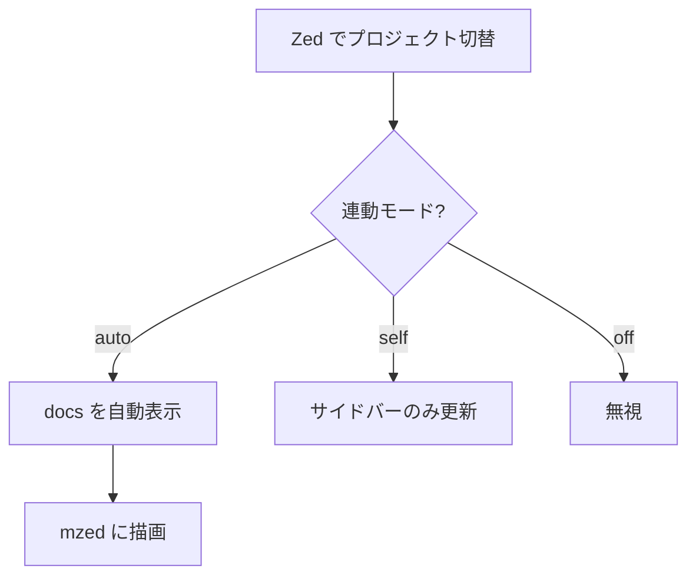

### シーケンス図

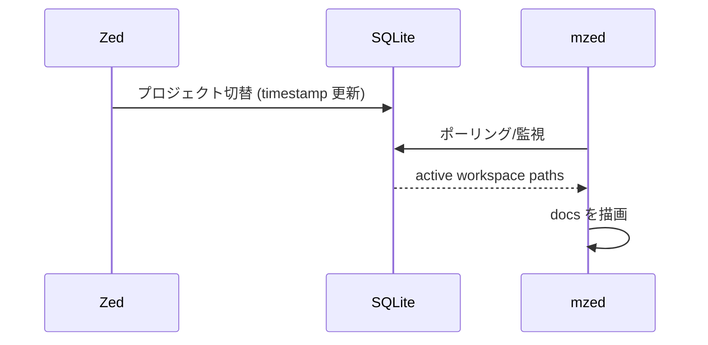

### クラス図

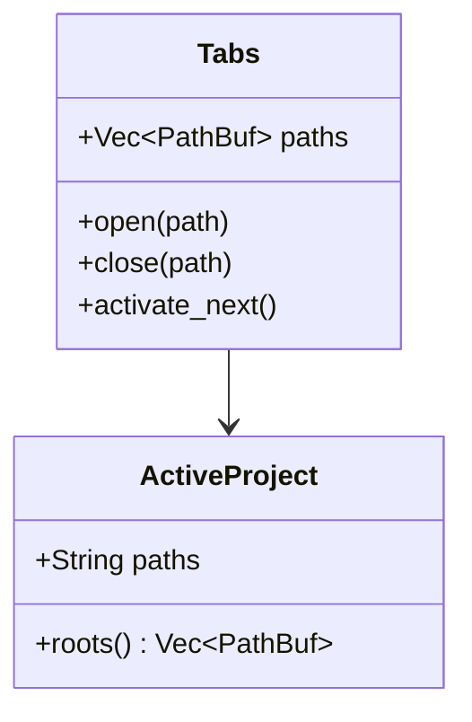

### 状態遷移図

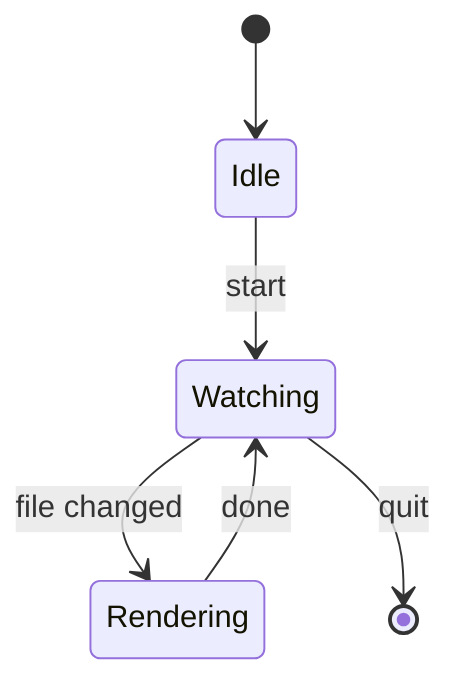

### ER 図

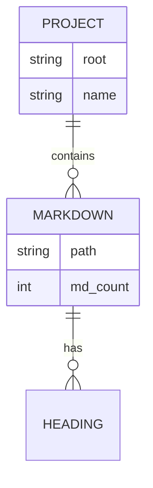

### ガントチャート

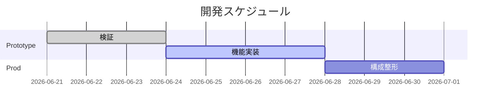

### 円グラフ

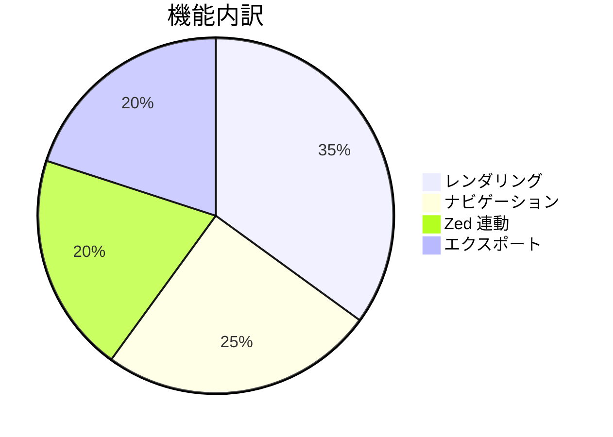

### ユーザージャーニー

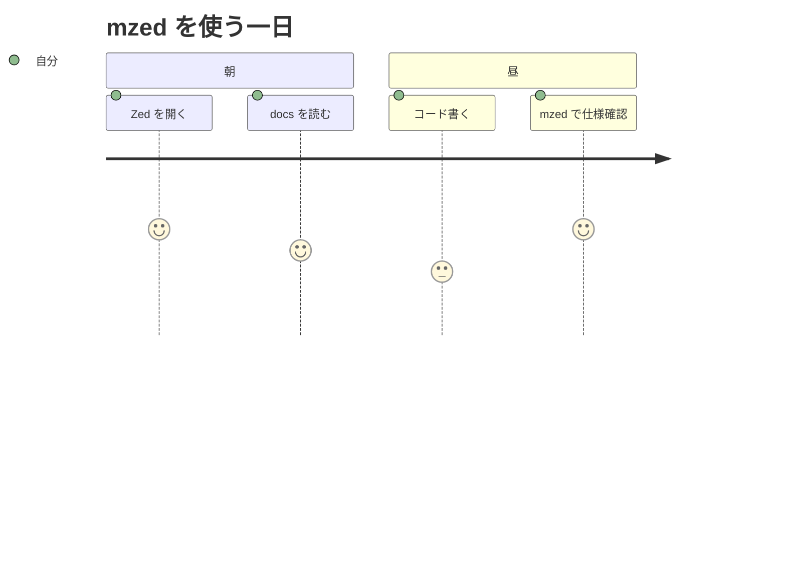

### Git グラフ

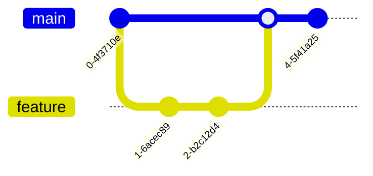

### マインドマップ

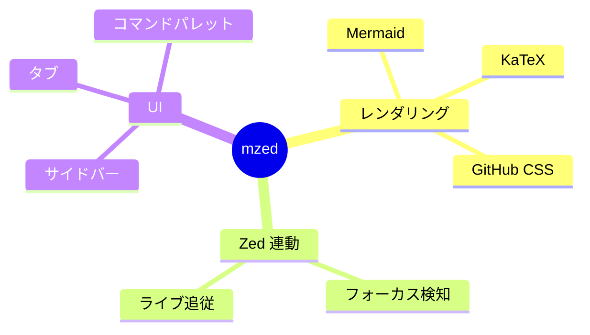

### タイムライン

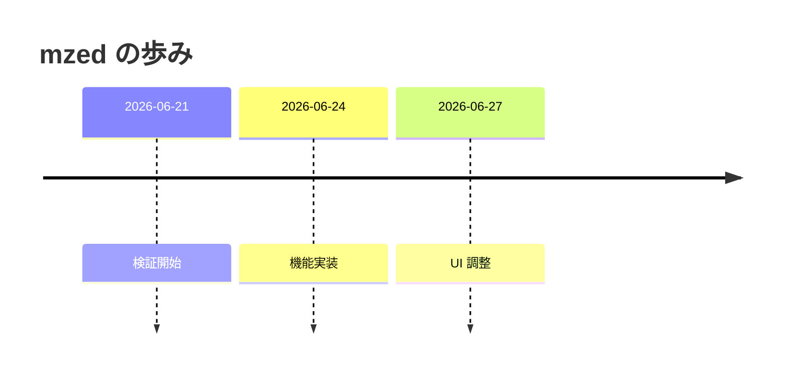

## 8. リンクと画像

- 内部リンク（同ディレクトリの別 md）: [リンク先ドキュメント](./linked.md)
- 外部リンク: [Zed](https://zed.dev) / [GitHub](https://github.com)
- 相対画像（同ディレクトリに sample.png があれば表示）: 
- リモート画像: 

## 9. 脚注

ここに脚注を付ける[^1]。複数の脚注も使える[^note]。

[^1]: これは最初の脚注。
[^note]: 名前付きの脚注。

## 10. 折りたたみ (details)

<details>
<summary>クリックで展開</summary>

中に隠れたコンテンツ。リストやコードも入る。

```rust
let hidden = true;
```

</details>

## 11. 長い見出し階層（ToC 確認用）

### 3.1 セクション

#### 3.1.1 サブセクション

##### 3.1.1.1 さらに深い見出し

###### 最深の見出し

---

以上。すべて正しく描画されていれば、mzed の主要レンダリング機能は網羅的に動作している。
